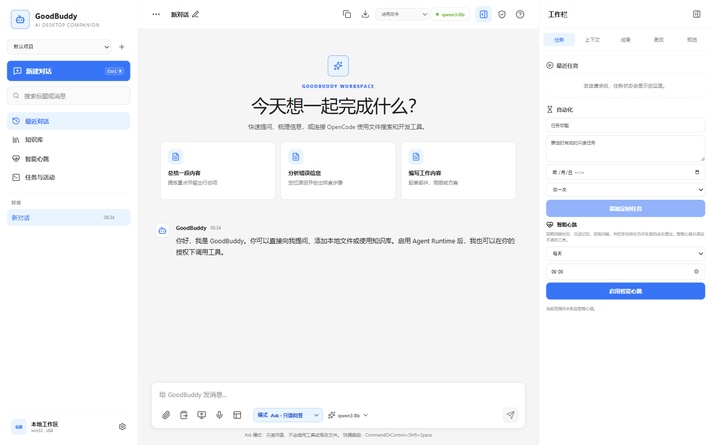
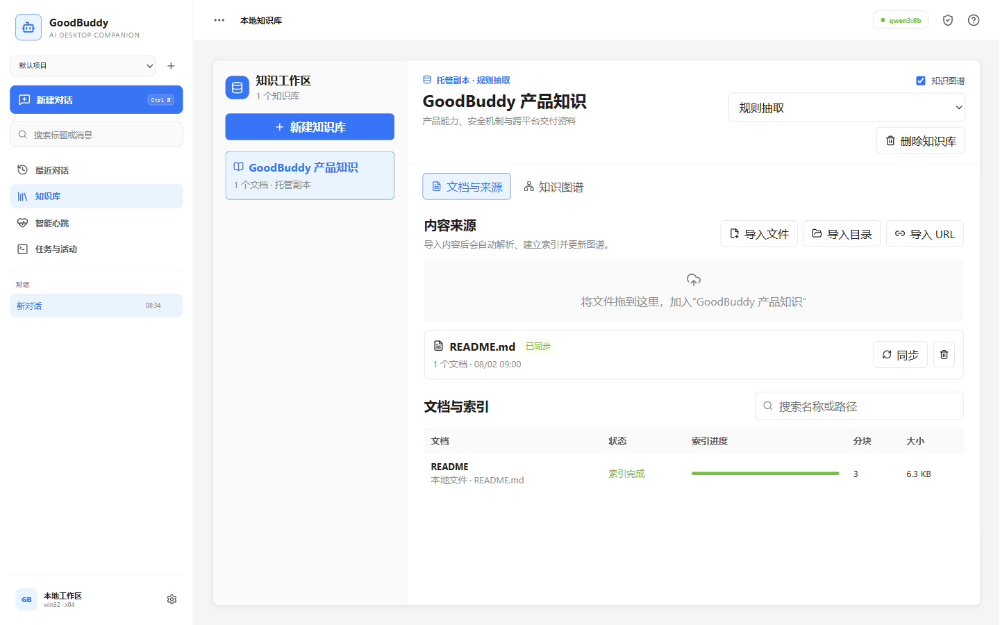
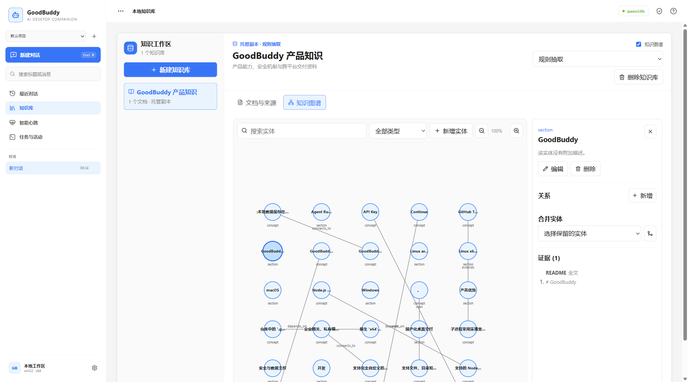
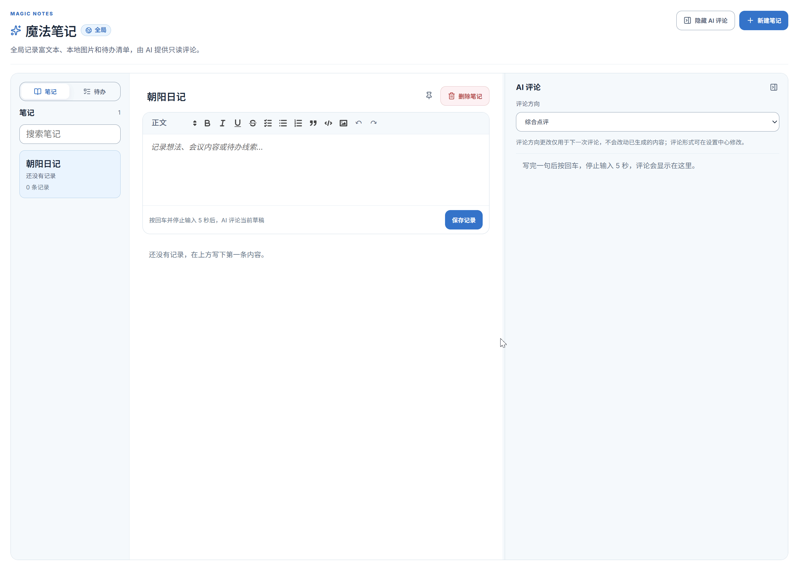
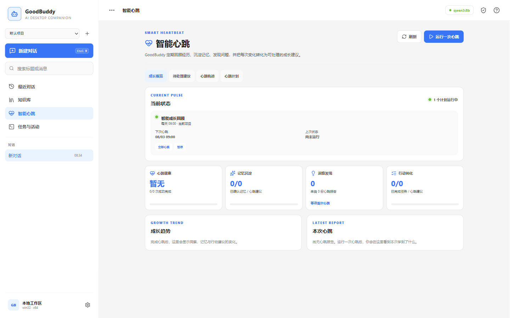

<div align="center">
  

# GoodBuddy

**模型对话、编程 Agent、本地知识库和定时任务的桌面入口**

[English](./README.md) | **简体中文**

[产品官网](https://mesalogo.github.io/goodbuddy/) ·
[下载](https://github.com/mesalogo/goodbuddy/releases) ·
[功能矩阵](./FEATURES.zh-CN.md) ·
[构建说明](./BUILD.md)

[](https://github.com/mesalogo/goodbuddy/releases)
[](./LICENSE)
[](https://github.com/mesalogo/goodbuddy/releases)
[](https://github.com/mesalogo/goodbuddy/releases)
[](https://github.com/mesalogo/goodbuddy/releases)
</div>



GoodBuddy 是用于模型对话、编程 Agent、知识检索、笔记和定时任务的桌面应用。使用 GoodBuddy 无需注册账号，工作数据默认保存在本机。模型服务可以运行在本机、组织内网或用户选择的云端服务。

## 主要能力

| 范围 | GoodBuddy 提供的能力 |
| --- | --- |
| Agent Runtime | 直连模型、OpenCode、Continue 和预览版 DeepSeek Harness |
| 数据与执行 | 本地 SQLite、只读 `Ask`、使用当前账号完整权限的 `Execute`、工具调用记录 |
| 知识库 | 导入文件、目录和网页，通过全文、中文词组、向量和知识图谱检索 |
| 桌面版本 | Windows、macOS、Linux 的 `x64` 与 `arm64` 正式版本，以及龙芯 LoongArch 实验预览版 |
| 外部连接 | 本机或内网模型服务、自定义 MCP、微信 ClawBot、企业微信和钉钉 |

## 产品界面

### 知识库与知识图谱





### 魔法笔记与智能心跳





## Agent Runtime

| Runtime | 适用场景 | 配置来源 |
| --- | --- | --- |
| 直连模型 | 对话、知识检索、图片生成和内置工具 | GoodBuddy 模型连接 |
| OpenCode | 编程 Agent、原生 Commands、Tools 和 Skills | GoodBuddy 管理或 OpenCode 自有配置 |
| Continue | Rules、Prompt 预设和编程任务 | GoodBuddy 管理或 Continue 自有配置 |
| DeepSeek Harness（预览） | 固定 Host 与可选插件能力 | GoodBuddy 管理的 OpenAI 兼容连接 |

每次运行都会记录取消、超时、Token 用量、工具调用和执行历史。各 Runtime 的原生能力与配置仍分别管理。

## 下载

从 [GitHub Releases](https://github.com/mesalogo/goodbuddy/releases) 下载：

| 系统 | 架构 | 格式 |
| --- | --- | --- |
| Windows | `x64`、`arm64` | NSIS、便携 ZIP |
| macOS | `x64`、`arm64` | DMG、ZIP |
| Linux | `x64`、`arm64` | AppImage、DEB、RPM |

龙芯 LoongArch 使用独立的 `loong64` 实验预览通道，可在[产品官网](https://mesalogo.github.io/goodbuddy/#download)选择下载。

桌面安装包不包含远端 Agent payload。本地项目无需 Agent 包；托管 SSH 用户可在设置中单独下载或导入。

当前未配置代码签名和 macOS notarization，操作系统可能显示安全提示。

## 从源码运行

需要 Node.js 24 和 npm：

```bash
git clone https://github.com/mesalogo/goodbuddy.git
cd goodbuddy
npm ci
npm run dev
```

构建与打包说明见 [BUILD.md](./BUILD.md)。

## 文档

- [功能矩阵与路线图](./FEATURES.zh-CN.md)
- [产品功能文档](./docs/features/)
- [UI 设计系统](./UI-DESIGN.md)
- [构建与打包](./BUILD.md)
- [发布流程](./docs/development/release-runbook.md)

## 隐私与执行边界

- 模型请求只发送到用户选择的服务。
- 本地数据默认保存在系统应用数据目录，API Key 由系统安全存储加密。
- Renderer 不接触原始 Electron API 或模型凭据。
- DeepSeek Harness 插件市场默认关闭。第三方插件安装脚本、初始化代码和 Execute 工具以当前用户权限运行。
- 远程委派只在用户配置端点和令牌后启用。
- 内网兼容模式允许应用内 HTTP 和非标准 HTTPS 证书；微信凭据和媒体端点仍执行严格校验。

## 参与贡献

欢迎提交 Issue 和 Pull Request。请先阅读 [AGENTS.md](./AGENTS.md)，提交前运行：

```bash
npm test
npm run typecheck
npm run lint
```

## 社区交流

扫描二维码加入 GoodBuddy 微信群：


## 开源许可

GoodBuddy 原创代码采用 [0BSD License](./LICENSE)，可自由使用、修改、分发和商用。第三方组件和资源遵循各自许可证。
