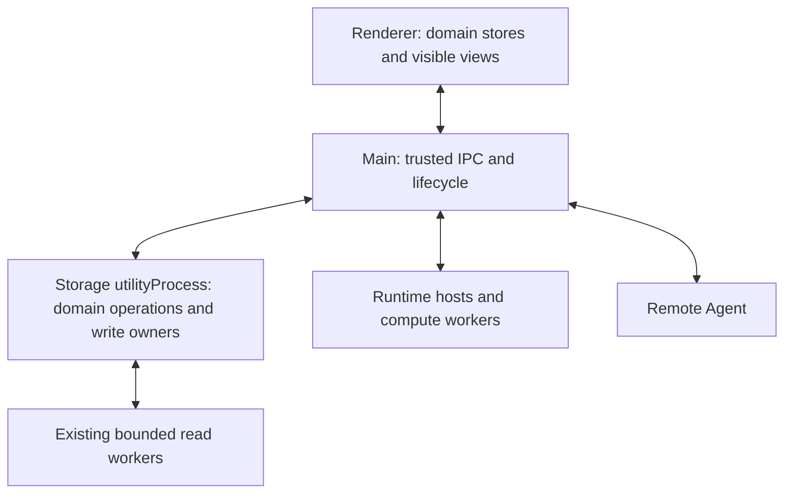

# Desktop Storage And Concurrent Execution

## Decision and delivery

Updated 2026-10-05 against `2be57492`. The user selected one complete architecture
delivery for PERF-15/PERF-16 and the necessary performance guards. This document
supersedes the earlier proposal to leave full migration for a later discussion.
The integrated migration and acceptance are not complete. The implemented storage
foundation, production composition and remaining acceptance work are recorded in
[Storage Foundation Integration](./desktop-storage-foundation.md).
Local fixes in `b90ff50f` remain the measured starting point.

Deliver the integrated design in one candidate, with normal product workflows and
concurrent acceptance passing together. Internal implementation dependencies do
not create separate partial product deliveries. A worker-only prototype, an async
facade over Main SQL, or a dual-write transition does not meet completion criteria.

This document owns architecture and scope. [Performance principles](./performance-principles.md)
own normative budgets and concurrency rules; [concurrent acceptance](../quality/concurrent-desktop-acceptance.md)
owns reproducible workloads and evidence. The [roadmap](../roadmap/product-performance-experience-improvement-plan.md)
tracks status, and the [local repair record](../review/kiss-local-fixes-2026-10-05.md)
preserves earlier measurements. Migration completion requires new acceptance evidence.

## Requirements

| ID | Required outcome |
| --- | --- |
| SA-01 | Desktop Main does not open or query business SQLite, directly or through a helper. |
| SA-02 | Complete domain transactions execute under one write owner per database. |
| SA-03 | Multiple projects, conversations and subtasks progress without unrelated global waits. |
| SA-04 | Requests, event buffers, result payloads and caches have bounded lifetimes and capacity. |
| SA-05 | Persistence, ordering, cancellation, recovery and user interaction semantics are preserved. |
| SA-06 | Startup, process failure and shutdown have one tested ownership path. |
| SA-07 | Static guards and concurrent production-path tests enforce the architecture. |
| SA-08 | GoodBuddy eliminates unnecessary intermediate disk writes and duplicate full outputs; necessary temporary resources have explicit ownership and cleanup. |

## Responsibilities



- Renderer retains presentation, local interaction state and disposable visible-data
  caches. Domain selectors subscribe narrowly. Hidden views retain required state,
  not continuous full rendering or whole-history refreshes.
- Main retains windows, trusted sender/schema checks, OS APIs, credential decryption,
  network/runtime orchestration and process lifecycle. SQL, large result assembly,
  hashing and bulk attachment file work do not execute on its event loop.
- One desktop storage utility process owns the existing business database files and
  exposes typed asynchronous domain operations. Keep synchronous SQLite inside this
  dedicated environment where it simplifies transaction correctness.
- Reuse bounded read-only workers for expensive reads. They open only after upgrade,
  read committed WAL snapshots, and do not run initialization or recovery. Storage
  owns their lifecycle; a project or conversation does not create a new worker.
- Parsing, OCR, embedding and Runtime execution retain their existing hosts. Network
  requests and model execution must not run inside storage transactions or hold the
  storage write queue. This work does not relocate browser-dependent OCR engines.
- Remote Agent databases remain remote. Changes to desktop storage must preserve
  remote replay, controller ownership and commit-before-ACK.

One write owner means exclusive business-write authority, not necessarily one OS
thread for all reads. Startup upgrades and existing maintenance/checkpoint workers
must be explicitly owned and excluded from competing business writes. Keep their
current bounded mechanisms where valid; do not create independent writers per domain.

## Ownership inventory

Inventory records current owners; destinations below are targets, not implementation facts.

| Surface | Current entry | Required destination |
| --- | --- | --- |
| `assistant.sqlite` | `src/main/assistant/assistant-database.ts`, constructed in Main | Storage service: conversations, tasks/events, activity, notes metadata, channels, supervision and timing persistence |
| `knowledge.sqlite` | `src/main/knowledge/knowledge-service.ts` and `knowledge-database.ts` | Storage service: schema, writes and external metadata; existing workers for costly reads |
| `conversation-attachments.sqlite` and referenced files | `src/main/conversation-attachment-storage.ts` | Storage service: references, adoption, reconciliation and bounded file IO |
| Document-result persistent lookup and note bodies | `document-result-storage.ts`, `magic-notes` storage | Async domain access to associated files; preserve original directories and reference semantics |
| Local remote-runtime binding DB | `src/main/remote-agent/managed-remote-execution-services.ts` | Storage service: transactional binding transitions and uniqueness |
| Native terminal / DS Web model-call ledgers | `native-terminal-client.ts`, `native-dsh-web-client.ts` instantiate `AgentModelCallLedger` | Storage service manages desktop ledger files under the existing client lifecycle; Main retains model/credential routing |
| Read, checkpoint and upgrade connections | `readonly-query-worker.ts`, `assistant-storage-worker.ts` | Service-owned steady-state reads/checkpoints; exclusive upgrade execution before readiness |
| Supervision manifest writer | `readonly-query-worker.ts` supervision mode and `SupervisionReviewStore` | Reuse scanning and manifest logic, but route its business mutations through the same write owner as publication; remove independent writer authority |
| Remote Agent journal, owners, prompts and ledger | `src/agent-daemon/daemon.ts`, `runtime-composition.ts` | Existing remote ownership, unchanged by desktop connection migration |
| Encrypted JSON settings and transient runtime caches | Existing settings/runtime services | Keep existing appropriate owners; async settings do not move merely to match a diagram |

An import scan must also find `openPrivateSqliteDatabase` and transitive constructors:
an implementation under `agent-daemon` can still open SQLite when called in desktop
Main. Do not weaken shared Agent code or relocate remote databases as a side effect.

Preserve existing database names, table formats, IDs, paths, scopes and durability
settings. Process relocation alone does not require a schema bump. Necessary schema
changes follow the [migration guide](../development/database-migrations.md).

## Existing work and consolidation

This inventory was checked against production callers on 2026-10-05. Reuse means
preserving working algorithms and contracts, not claiming their current transport,
cancellation or close semantics already meet the target. Implement the replacement
at the existing seam and remove superseded callers in the same delivery.

| Existing mechanism | Reuse or extend | Retire or avoid |
| --- | --- | --- |
| [ReadonlyQueryReader](../../src/main/readonly-query-reader.ts), [worker handlers](../../src/main/readonly-query-worker.ts) | Reuse request correlation, named operations, errors, lazy lifecycle and reader handlers; adapt the outer utility transport and strengthen typed operations, readiness, byte bounds and settlement-aware close | No second equivalent storage RPC client or admission queue; remove production infrastructure fallback through `readWithFallback`, not legitimate owner-local transaction reads |
| [Startup storage](../../src/main/assistant-storage-startup.ts), [upgrade worker](../../src/main/assistant-storage-worker.ts) | Preserve migration algorithms, progress, retry and cancellation; move SQL preflight into the storage-owned exclusive startup path | Remove Main SQL preflight and competing upgrade launch ownership; do not add a new migration framework |
| [Checkpoint and supervision connections](../../src/main/assistant/assistant-database.ts), [review store](../../src/main/assistant/supervision-review-store.ts) | Reuse PASSIVE checkpoint and manifest scan/revision algorithms; make checkpoint exit awaited and manifest writes owner-controlled | No second maintenance service or independent business writer hidden in a read-worker entry |
| [EmbeddingIndexRepository](../../src/main/knowledge/embedding-index-coordinator.ts), [binding store interface](../../src/main/agent/runtime-session-binding-store.ts), [activity repository](../../src/main/assistant/activity-history-repository.ts) | Reuse domain interfaces and transaction algorithms; adapt the desktop backing implementation and async callers | Do not add remote object proxies or duplicate repositories; Promise-returning methods are not proof of off-Main execution |
| [RemoteEventBatcher](../../src/main/remote-event-batcher.ts) | Extend existing batching with awaited persistence/flush and pending-plus-in-flight bounds; update recovery, background and interactive IPC consumers | No second durable event coalescer, receipt ledger or retry queue; no ACK or forwarding before commit |
| [AgentModelCallLedger](../../src/agent-daemon/agent-model-gateway.ts), [terminal client](../../src/main/agent/native-terminal-client.ts), [DS Web client](../../src/main/agent/native-dsh-web-client.ts) | Preserve schema, claim/deduplication and uncertain outcomes; desktop access becomes awaited storage operations | Do not relocate remote Agent ledgers; remove desktop concrete synchronous opens and early directory deletion |
| [Utility transport](../../src/main/knowledge/embedding-utility-transport.ts), [Harness readiness](../../src/main/agent/deepseek-harness-utility-launcher.ts), [shutdown helpers](../../src/main/shutdown.ts) | Reuse fork/entry/exit adapters and phased application shutdown; add storage readiness and drain at those seams | No new generic process supervisor, duplicate shutdown path or copied Harness streaming/version protocol |
| [Runtime controller](../../src/main/agent/runtime-controller.ts), [selected runtimes](../../src/main/agent/selected-runtime-manager.ts), [remote backend](../../src/agent-daemon/runtime-acp-backend.ts) | Keep request ownership, session reuse and retirement; inspect remaining global open/prepare/close waits with healthy peers | No second Runtime pool or global execution manager; the prior route-cleanup fix does not prove every global wait is gone |
| [Subagent scheduler](../../src/main/assistant/subagent-scheduler.ts), [supervision model pool](../../src/main/assistant/supervision-model-pool.ts), [review admission](../../src/main/assistant/supervisor-service.ts) | Retain task slots, review single-flight and per-model-call pool as distinct existing scopes; extend capacity/settlement tests where needed | Do not merge ordinary chat into the supervision pool or create another task state machine/provider scheduler |

The current ordinary reader removes a cancelled request from `pending` before worker
settlement, and `close()` provides no exit barrier. Supervision waits longer and can
substitute cancellation for a successful result. Extend these semantics to
represent actual execution and committed outcomes; do not copy them unchanged into
the storage client and call its capacity or shutdown complete.

Supervision's temporary scan table belongs to one SQLite connection. Retain the
bounded scan, transfer only bounded manifest data to its write owner, and preserve
initialization/resume invariants. Existing 200-row commits run in synchronous loops;
they do not themselves yield an execution turn. Yield at safe existing batch boundaries
without dividing final atomic publication or introducing a general scheduler.

Renderer consolidation stays within existing domains:

- [Conversation store](../../src/renderer/src/conversation-store.ts) and
  [persistence](../../src/renderer/src/conversation-persistence.ts) already own ordered
  deltas, save serialization, history requests and quit flushing. Extend those paths,
  not a second `conversation-sync` queue. Its current React-aware integration is not
  a reason to introduce another store library.
- [Activity sync](../../src/renderer/src/activity-sync.ts) owns paging, pending writes
  and retry; [task sync](../../src/renderer/src/task-sync.ts) owns task/artifact refresh.
  Tighten projections and retention there. A resolved flush that caught an error and
  requeued data is not a durable success barrier; extend its explicit completion
  semantics where dependent reads or shutdown require persistence.
- [Live messages](../../src/renderer/src/live-message-store.ts),
  [public event buffering](../../src/main/agent-event-buffer.ts), and
  [terminal batching](../../src/renderer/src/terminal-output-batcher.ts) serve distinct
  display stages. Keep them separate from durable remote batching and avoid an
  additional universal event bus or a second coalescing delay.
- Retain domain cache owners: [keep-alive](../../src/renderer/src/keep-alive-cache.ts),
  [Markdown](../../src/renderer/src/markdown-render-cache.ts),
  [channel status](../../src/renderer/src/channel-status-store.ts), and
  [Supervisor scope reads](../../src/renderer/src/SupervisionStories.tsx).
  Preserve pinned-pane exceptions and scope/revision guards; strengthen bounds at
their existing owners.

Runtime session behavior remains authoritative in the
[reuse design](../features/assistant-workbar/runtime-process-reuse-technical-design.md).
[Task timing](../features/task-and-job/technical-design.md) and
[supervision model scheduling](../features/conversation-supervision/technical-design.md)
retain their existing semantics. Ending an elapsed-time segment on abort does not
release an execution slot before cleanup; do not unify these clocks or restore
historical timing scans/statistics workers during this migration.

Completion includes a removal inventory tied to the table above: old Main opens,
external live-store factories, production sync fallbacks, obsolete transport callers
and independent business writers have no production references. Remove only the
superseded implementations, not valid in-owner synchronous algorithms, remote stores,
released-data compatibility or historical test evidence. No permanent dual path or
unused compatibility wrapper is part of the delivery.

## Operation boundary

Reuse repository algorithms behind domain operations: save conversation changes,
commit remote events, publish a review, adopt attachment references, or transition
a runtime binding. Public renderer IPC can keep its current shape while Main awaits
the storage client. No generic SQL endpoint or function serialization is introduced.

Existing transaction callbacks and returned live repository objects stay inside the
owner. Replace their external use with typed inputs/results. In particular,
`readSnapshot`, Knowledge publication callbacks and Supervisor store factories must
not be transported or accept an asynchronous callback that outlives a sync transaction.

The channel extends the request/handler and utility-adapter seams identified above,
correlates requests/results and carries named operations,
serializable arguments, cancellation and readiness/failure. Reuse installed Electron
transport patterns; do not add a general RPC dependency, persisted transport sequence,
protocol negotiation or a service discovery layer for this bundled child process.
Validate actual transport behavior for buffers, Maps and errors; use DTOs. Live classes,
subscriptions and handles remain with their owners. Errors retain usable codes and causes
without credentials or user content in diagnostic logs.

Queries return the requested projection. Lists use summaries/pages; source bodies,
tool outputs and attachments load through detail paths. Large results must not be
JSON-assembled in Main or copied through several caches. Existing source records are
not truncated to satisfy a latency check. A read transaction ends before posting its
reply so a slow consumer cannot keep a WAL snapshot open.

## Concurrency and ordering

Keep ordering at the smallest required scope. A conversation's persisted sequence
and a database's commits remain ordered; independent model waits, sessions and
read requests do not share a global long-running lock. Runtime process reuse retains
per-binding/session/operation identity; cancelling one request must not stop its peers.

Use existing finite concurrency and batch mechanisms before adding scheduling code.
Apply capacity to queued bytes as well as operation count where payload size varies.
When a queue fills, wait or report the existing actionable busy/error state; never
silently discard user messages, tool results or acknowledged events. Obsolete read
refreshes and display progress can coalesce; persisted evidence cannot. Preserve one
bounded batch of work before yielding so other admitted producers can progress;
change scheduling only where concurrent measurements demonstrate starvation.

Heavy reads use the read workers and leave necessary writes able to progress. UI/control
requests must not wait behind model networking, import parsing or route cleanup.
Control processing must not depend on acquiring another execution slot. This is a
resource-boundary rule, not a mandate for a new global priority scheduler.

For long publications, compute immutable data before the write transaction when
possible, then validate current database preconditions inside the transaction and
commit the complete result/checkpoint atomically. Do not await models, filesystem
callbacks or IPC while holding a write transaction. An atomic publication cannot be
split into externally visible partial commits to improve timing. Worker relocation
does not eliminate the single-writer bottleneck: acceptance measures queue wait and
commit time, as well as Main responsiveness.

## Persistence and cancellation

| Operation | Required completion meaning |
| --- | --- |
| Cached UI preference/read | Synchronous memory access is allowed; cache ownership and invalidation are explicit |
| Existing coalesced local saves | Preserve current flush semantics and expose the existing flush barrier to dependent reads/exit |
| Remote event batch | Persist event/checkpoint under existing durability, then notify/ACK; enqueueing is not commit |
| Channel outbox / runtime ledger | Preserve duplicate-dispatch prevention and uncertain-outcome handling; no blind retry after lost replies |
| Review publication | Facts, result status and checkpoints commit together or roll back together |

Abort removes queued work before dispatch. In-flight work reaches a defined safe
point and reports its actual outcome; capacity is released only after settlement or
confirmed host exit. Caller cancellation, operation termination and resource release
are distinct observations, not three new persistent product states.

`worker_threads` SharedArrayBuffer cancellation must not be assumed to cross
`utilityProcess` IPC. Reuse it only within verified thread boundaries. A message
cannot interrupt synchronous SQL while the receiver is blocked. Keep SQL/transaction
units bounded, check cancellation between safe units, and report a completed commit
as committed even if cancellation arrived too late. Do not terminate a shared storage
process to cancel one request or promise instantaneous rollback of a committed write.

Filesystem adoption and SQL references are not automatically one atomic transaction.
Preserve existing staging, adoption and reconciliation order with async file APIs.
Do not delete originals or release protected in-flight files early; do not introduce
a cross-database transaction engine or recovery journal.

## Lifecycle and failure

Main starts and supervises one storage process using existing utility-process
patterns. Process spawn is not readiness: required migrations, connection opening
and startup recovery must finish before storage-dependent operations are accepted.
Show the existing startup/upgrade progress and retry UI. Render the application shell
when safe without marking unavailable data as an empty successful result.

After process loss, reject affected pending requests with bounded diagnostics, stop
admitting writes, confirm exit and close transport resources before replacement.
The existing user retry/reopen lifecycle can re-establish storage readiness. Read-only
work can be repeated when requested. For writes without a response, consult existing
task/event/result identities and deduplication before claiming failure or retrying;
model dispatch marked uncertain must not be sent again automatically. No Main SQL
fallback, silent empty database, second durable receipt ledger or unbounded restart loop.

Shutdown stops producers and new admission, cancels unnecessary reads, drains required
writes, closes readers/checkpoints/connections, and observes storage process exit.
Extend the existing phased shutdown and deadline, including explicit storage failure
reporting; existing settled-error helpers alone do not prove a successful drain. Native client ledger
directories are removed only after their connection is closed. Upgrade/maintenance
requires exclusive ownership before changing files, following the existing maintenance
path; it cannot open an extra Main business connection.

## Output and temporary resource ownership

This work is included in the same architecture delivery. The [source investigation](./runtime-storage.md#output-and-temporary-file-investigation)
records current producers and persistence gaps. Scope is GoodBuddy-created material;
third-party MCP/Runtime internals and user workspaces are not cleanup targets.

Decide content ownership before choosing a temporary directory. Ordinary requests,
responses, concatenation and short outputs stay in bounded memory. Where an existing
record or artifact already contains complete content, pass its reference and read pages
from that owner. Do not write a temporary copy merely to cross IPC or call MCP.

Current tool events often contain only previews. Preserve full paging access by adapting
the existing `PagedOutputStore` interface to the storage/attachment owner: output that
must outlive bounded in-memory capture has one backing content object, with events
carrying previews and its reference. Write directly to that backing object; do not spool
to Temp and later copy the same bytes to another full-output store. Reuse existing file
adoption/reference/release operations and paged reads, without a second output database,
generic blob service or durable transport journal. Final answers, previews and full
stdout/stderr remain distinct data.

The storage object's retention follows its consumer. Call-only output is released when
its existing owner no longer needs paging; content referenced by persisted history is
released through that history's existing reference cleanup. Being stored by the storage
service does not make every intermediate output permanent. Keep small call-only output
in memory and preserve existing model limits. Avoid adding whole-output copies to events
or retaining all concurrent streams in an unbounded buffer. Size alone does not justify
an additional temporary copy.

The replacement must specify the complete-content reference and byte cursor through
process, search, subagent and `output_read` paths before removing the old file backend.
Inspect remote mapping separately: it does not use the local process spool and cannot
recover omitted bytes from already-pruned Agent events. Preserve supported remote
content/ACK semantics; this work does not promise new full-history capture from third-party
runtimes. Remove the old spool creation and synchronous Main paging only once the shared
replacement preserves the existing full-output contract.

### Necessary temporary material

External CLI configuration, plugin modules and atomic replacement/install staging may
still require files. Reuse environment/in-memory configuration when already supported;
otherwise keep the actual external contract. Atomic sibling files and installer staging
stay on their required filesystem under their existing owner, not a forced central root.

For disposable runtime launch material, pass a root from application initialization
through existing constructors; create it lazily:

```text
<userData>/temp/goodbuddy-runtime/<appVersion>/<runId>/
  goodbuddy-runtime-launch/
```

Add purpose directories only for evidenced necessary files. Do not precreate process,
search or subagent output trees. User-visible disposable roots retain `goodbuddy-`
prefixes. Tests use `<repository>/temp/goodbuddy-<task>-<runId>/`; remote resources use
GoodBuddy-owned prefixed roots on the Host. Do not modify global `TEMP` or relocate
third-party histories/caches through an indiscriminate environment override.

The creator removes partial creations on failure. Existing service shutdown closes
children/handles and then releases its resources. Startup, including the next upgrade,
reclaims obsolete owned run directories after the existing single-instance check and
verification that no owning child remains active. Version/run IDs identify candidates;
they do not establish inactivity. Reuse process ownership checks, with only the minimal
owner information needed to identify surviving children; do not create a lease service.
Cleanup runs in bounded background work and cannot delay the first screen with a full
filesystem scan. Failed deletion leaves the known directory available to retry.

Legacy OS-Temp prefixes require an explicit list of layouts, creator and inactivity
evidence. Reclaim confirmed obsolete instances, preserve ambiguous/live directories,
and report the remaining scope. Never delete arbitrary `goodbuddy-*`, `.tmp` or `.partial`
paths by age. Existing installer/reference reconciliation retains its own roots and
rules; no global garbage collector, cleanup ledger or user-data migration is introduced.

## KISS constraints

- Keep Electron, TypeScript, SQLite and existing provider/runtime integrations.
- Add the one storage utility process, not processes per project/session/subtask.
- Reuse reader, checkpoint, parser, batching and lifecycle mechanisms where appropriate.
- Keep credentials/OS integration in Main; storage receives only required business data.
- Do not add general schedulers, distributed transactions, durable RPC journals,
  compatibility readers for unshipped intermediates, new approval gates or user modes.
- Synchronous cache reads and pure calculations need not become RPC calls.
- The runtime host, database driver and UI framework are not replaced as incidental work.

## VS Code reference

VS Code demonstrates service separation, asynchronous execution, lazy activation,
cached state and coordinated close. Its application/profile/workspace storage is
owned by Electron Main, uses async `@vscode/sqlite3`, and batches cached key/value
writes. GoodBuddy retains `DatabaseSync` in a dedicated execution environment because
its relational history, graph queries and durable event acknowledgements differ.
Do not copy full-state memory loading or empty-store recovery into business history.

Sources reviewed on 2026-10-05, upstream main; no same-machine benchmark is claimed:

- [Connection ownership](https://github.com/microsoft/vscode/blob/main/src/vs/platform/storage/electron-main/storageMain.ts)
- [SQLite backend](https://github.com/microsoft/vscode/blob/main/src/vs/base/parts/storage/node/storage.ts)
- [Cache and flush lifecycle](https://github.com/microsoft/vscode/blob/main/src/vs/base/parts/storage/common/storage.ts)
- [Extension hosts](https://code.visualstudio.com/api/advanced-topics/extension-host)

## One-delivery completion

SA-01 through SA-08 must pass together under the [acceptance matrix](../quality/concurrent-desktop-acceptance.md).
All listed desktop owners, normal/background/error/cancel/exit callers, and native
client ledger paths must use the final boundary. Remove the superseded Main openings,
direct storage access and synchronous fallbacks, including helper-based bypasses.
No feature-disable workaround or loss of user interaction counts as completion.

Run production UI-to-storage tests, existing full validators, old-data integrity and
concurrent before/after measurements; validate affected desktop-to-Agent behavior on
the shared Linux x64 Host. Native platform CI verifies process startup, SQLite and
packaged entry/resource paths. Follow the release runbook for production builds and
packaged-app checks, including measurement runs.

The acceptance record must report latency, throughput, backlog and resource cleanup,
including failures. A responsive UI with stalled background commits is not success.
No target implementation, new performance baseline or migration completion is claimed
by this documentation update.
