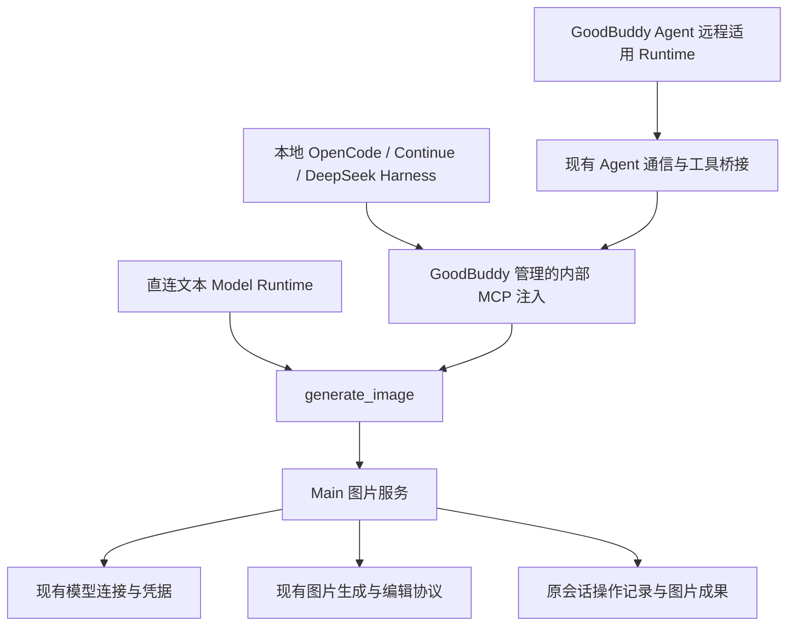

# 技术设计

状态：工作区实现已接通，真实图片服务与完整产品验收未完成，证据见[进度记录](./progress.md)。内部契约实现 [FR-1 至 FR-9](./prd.md)及[行为规则 L-1 至 L-5](./logic-design.md)，不作为外部公开 API。

## 调用结构

Main 持有图片请求、取消句柄及结果保存职责，生命周期独立于聊天 Runtime controller。切换或释放聊天进程不释放已提交图片操作。Renderer 的取消等操作经明确 preload/IPC 方法进入 Main，沿用共享契约和发送方校验。凭据只在 Main 解密，不写入工具说明、参数、输出或远程 Runtime 配置。

`ImageGenerationService` 复用 `ModelAgentRuntime.generateImage` 的图片请求和校验，在 Main 保存操作及成果。工具路径按 L-2 明确区分新建和编辑，不自动将缺少素材或不支持的编辑降为文生图；已有直连图片路径保持原上下文规则。

## 工具与注入

稳定图片工具 `generate_image` 同时负责生成和编辑。当前输入为 `prompt`、可选 `modelProfileId`、`intent`（`create` 或 `edit`）、`sourceArtifactIds` 和可选 `quality`；类型及编辑素材约束由 `src/shared/image-generation-contracts.ts` 校验。每次请求沿用已有协议的单图生成和尺寸行为，没有新增数量或尺寸参数。原会话、触发消息和工具调用关联由运行上下文绑定，LLM 不能自由指定结果写入位置或任意文件路径。

每个新回合提供可调用图片模型的脱敏 ID、名称及生成、编辑能力，模型切换、配置变化或进程复用时刷新。Main 提交前重新校验工作模式、连接开关、所需能力及素材。优先由工具描述承载模型选择、图片引用和结果使用说明，不把 Skill 管理作为依赖。

直连文本 Model Runtime 使用内置工具契约及分发；外部 Runtime 复用内部 MCP 注入，由 GoodBuddy 自动注册、配置和管理生命周期，远程路径经现有 Agent 工具桥接调用同一服务。内置 MCP 列表中的图片行只展示这项受管能力，不代表直连 Model 也通过 MCP 调用。无需用户创建 Skill、另建 MCP server 或复制凭据，不按模型连接复制工具或 Skill。

Main 从已保存图片 profile 的会话调用开关推导允许模型目录，并以目录是否非空推导全部支持 Runtime 的分配。Renderer 只读取派生分配；该受管行不接入通用 MCP 的启停、分配、删除或凭据编辑写入接口。模型配置保存后刷新展示及注入目录，进程复用和下一回合重新读取；运行中的回合及已提交操作继续遵循 L-1、L-3。配置错误、Runtime 在线状态、聊天模型工具能力与执行结果独立于派生分配，不因这些状态移除允许目录中的模型或取消勾选。

不预建能力发现、查询或取消工具目录。只有实际 Runtime 协议要求独立发现、查询或取消交互，且现有工具描述、响应及 UI 操作不能满足时，才增加所需的最小适配，并记录协议依据；这些适配仍调用同一 Main 图片服务，不形成新的媒体平台。取消默认从会话卡片进入 Main。

工具等待遵循现有超时约束，返回操作 ID、实际模型、真实状态及完成后的成果 ID，不把 Base64 塞入工具历史。原回合仍有效时通过合法工具响应返回结果；回合结束或 Runtime 切换后，Main 继续写原会话，下一回合读取操作摘要及成果引用，不补发旧响应、不自动唤起 LLM 或重发图片请求。

## 配置与持久化

| 对象 | 最小数据与职责 |
| --- | --- |
| 图片模型连接 | 复用 settings/profile，增加会话调用开关；现有连接缺少开关时解释为关闭 |
| 图片能力与 Runtime 分配 | 从图片模型配置派生，只读展示；不新增独立可变的 capability enabled、assignment 设置或持久化副本 |
| 全局偏好 | 默认图片 profile ID，复用应用设置；本次指定只属于请求，不新增会话级选择 |
| 生成操作 | 优先使用现有消息 metadata，保存操作 ID、原会话/消息、工具关联、状态、实际模型 ID 与名称、提示词、有效参数、素材引用、时间、错误及成果 ID |
| 素材与成果 | 复用附件和 artifact 持久化，保存上传图片、生成图片及编辑来源关系，不能只存于 Runtime 内存 |

活动请求在 Main 内存持有提交时连接参数，持久记录不复制凭据。应用重启后未完成操作显示结果未确认，不建立跨重启查询恢复、凭据历史、通用恢复日志或自动重试。取消和晚到结果按 L-4 更新同一记录；人工重新生成使用新操作 ID。

不新增独立任务表、视频字段或通用调度器，操作不自动成为 Task/Job。若实施涉及已发布数据，按[迁移规范](../../development/database-migrations.md)处理实际兼容需求，不预建迁移或恢复机制。

Main 仅在图片和会话引用持久化成功后发布完成事件。素材必须是当前会话可访问的附件或成果，沿用已有项目和会话边界；删除会话后的晚到结果不重建会话。

会话刷新共用保留对象引用的图片状态合并：无图片或图片状态未变化时，不重建消息并触发
整段历史重新保存。未打开历史的读取与缓存释放遵循
[会话列表读取与前端保留](../assistant-workbar/execution-history-storage.md#会话列表读取与前端保留)，
不改变图片操作的 Main 所有权、成果关联或时间优先级。

## 图片协议

沿用[图片技术设计](../image-generation/technical-design.md)的已有生成、编辑协议及素材限制。接收并校验有界内联图片，不下载 Provider 返回的图片 URL。沿用现有成果存储限制，实施时核对编码开销与超限反馈，不以配置检查成功代替真实生成验收。视频协议、下载、播放及交付计划均不属于本设计。

## Runtime 接入

| 路径 | 设计接入点 | 必须完成的验证 |
| --- | --- | --- |
| 直连文本 Model Runtime | 现有内置工具契约及工具分发转入 Main 图片服务 | 自然语言生成、上传图编辑、历史图编辑及切换 |
| 本地 OpenCode | 现有内部 MCP 注入转入同一服务 | 实际工具往返、能力刷新、生成编辑及切换 |
| 本地 Continue | 现有内部 MCP 注入转入同一服务 | 实际工具往返、能力刷新、生成编辑及切换 |
| 本地 DeepSeek Harness | 现有内部 MCP 注入转入同一服务 | 实际工具往返、能力刷新、生成编辑及切换 |
| GoodBuddy Agent 远程适用 Runtime | 复用桌面与 Agent 通信及工具桥接，将请求绑定原会话，由 Main 调用图片模型 | 逐一验证实际支持的远程 Runtime，覆盖真实 Host 工具往返、生成编辑、本地与远程双向切换、断连及成果归属 |
| 无工具能力的聊天模型 | 说明自动调用限制，可使用已有直连图片工作流 | 不解析普通文字伪装工具调用，不新增表单；Ask 不提交 |

本地 OpenCode、Continue 和 DeepSeek Harness 经内部 MCP gateway 注入；直连 Model 使用内置工具分发。远程通过 `main-image-tool-session.ts`、Agent 协议和 `image-tool-mcp.ts` 回到同一 Main 服务。当前受管远程 Runtime 包括 OpenCode 和 Continue；Continue 模型桥的会话 MCP 交付及 Ask 边界见[远程 Runtime](../remote-host/technical-design.md#runtime)。保留会话在目录清空时也刷新 MCP，Continue 准备失败时释放本次分配的令牌。工具发现、无计费测试接收端往返或 Skill 注入成功不能代替真实生成与编辑。

Main 已接收的请求在桌面仍运行时独立于远程连接继续；未确认是否接收的请求不自动重放。聊天回合停止等待与用户取消图片是不同动作，须验证现有取消传播不会误杀 Main 图片请求。

## 实施与验证

实施工作包括配置与选择、Main 图片服务提取、各本地及远程 Runtime 工具适配、成果与状态 UI。它们共同完成本图片功能，不按 Runtime 划分交付范围。

针对 L-1 至 L-5 验证选择优先级、失效配置、上传与历史素材、无视觉模型、Ask、会话归属、重复通知、取消及晚到结果。检查切换聊天模型、图片默认模型、本地与远程 Runtime 后的新生成和编辑，以及旧操作不重复提交。回归已有直连图片工作流。

按 US-16 至 US-19 验证从零到一个开启模型、多个中关闭或删除一个、最后一个关闭或删除、重新开启，以及配置错误和 Runtime 离线时的派生分配、目录刷新、行可见性与只读交互。重开设置和应用后均从模型配置推导，不恢复独立分配值；辅助技术可读取标签、勾选状态和说明，键盘可到达模型设置导航。

源代码实现后运行 `npm test`、`npm run typecheck`、`npm run lint`，并逐路径执行[用户场景](./user-stories.md)的真实产品验收，记录模型、Runtime、请求数量和结果。涉及 Agent 的实现按[远程主机验证要求](../remote-host/technical-design.md)在真实测试 Host 验证。实施和集成验证状态由[进度记录](./progress.md)维护。
