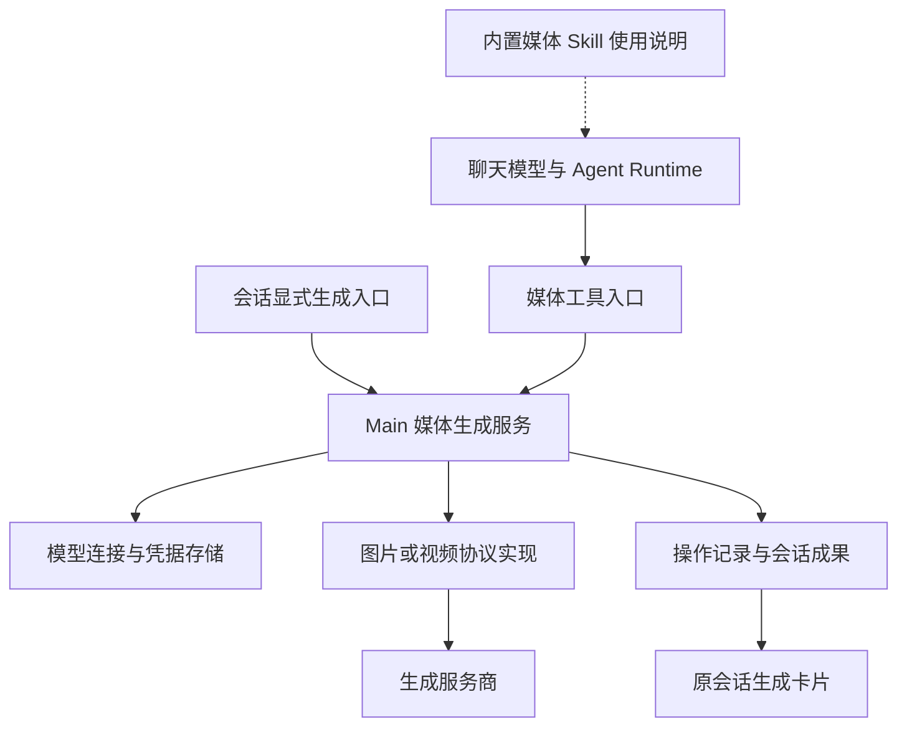

# 技术设计

状态：设计草案。拟议字段和工具名用于评审，不表示已存在公开 API。实现 [FR-1 至 FR-9](./prd.md)及[行为规则 L-1 至 L-5](./logic-design.md)。

## 首期实现边界

首期调用路径为：直连文本 Model Runtime → `generate_image` → Main 图片生成服务 → 现有图片协议 → 原会话 artifact。提取已有图片请求和保存逻辑，Main 持有活动请求，使聊天模型或 Runtime 切换不释放已提交生成。复用现有成果视图与活动反馈。

只新增图片会话调用开关和全局默认图片 profile ID；本次指定作为工具参数。生成记录优先放入现有消息 metadata，保存实际模型、输入、状态及成果引用。首期没有会话级生成选择、视频字段、上游任务恢复信息或独立任务表。

工具说明随每个新回合提供可调用图片模型的脱敏 ID、名称和已支持能力，提交前重新校验配置。先以工具描述承载使用规则；只有实际调用验证表明说明不足时才补充一份共享 Skill，不把 Skill 管理作为交付依赖。首期不注册 `list_media_models`、视频、查询和取消工具，取消通过会话中的操作入口完成。

工具等待遵循现有超时约束；超出回合等待或发生 Runtime 切换后，Main 仍将结果写回原会话。后续回合读取已保存的操作摘要和成果，不补发旧工具响应。应用重启后未完成记录只提示结果未确认，不建立恢复查询或自动重试机制。

以下章节描述完整目标中的调用关系和扩展约束。出现视频、会话选择、额外工具、独立生成表单、其他 Runtime 接入和恢复查询时，均属后续设计，不要求首期预建抽象或占位实现。

## 调用结构

Main 持有生成请求、取消句柄和结果保存职责。服务生命周期独立于聊天 Runtime controller，切换或释放 controller 不释放已提交的媒体操作。Renderer 经明确 preload/IPC 方法调用；IPC 使用共享契约校验并保留现有发送方校验。凭据只在 Main 解密，不进入 Skill、工具参数或工具输出。

从 `ModelAgentRuntime` 提取现有图片请求、校验和成果处理中的可复用部分，使直连图片与媒体工具共用协议实现。直连路径保持原有上下文与编辑降级策略；工具路径依据 L-2 传入明确的素材和降级选项，避免协议重用改变产品语义。

## Skill 与工具

提供一份内置媒体生成 Skill，说明新建、编辑、图生视频、模型选择、素材引用和结果使用。开启模型配置仅更新能力目录，不为每个连接复制 Skill。能力目录与工具从同一份有效配置生成；Skill 中不保存可过期的模型名单或凭据。

拟议工具：`list_media_models` 返回脱敏的可用连接 ID、名称、已支持操作及参数约束；`generate_image`、`generate_video` 提交生成；`get_media_generation` 查询；`cancel_media_generation` 取消。按操作性质接入现有工作模式控制，不因媒体工具增加额外通用审批。

生成输入包括 `prompt`、可选 `modelProfileId`、显式 `operation`、`sourceArtifactIds` 及协议支持的类型化选项。图片数量、尺寸与质量，以及视频时长、分辨率等按已接入协议校验，不能假定服务商完全兼容。`conversationId`、触发消息及请求身份由运行上下文绑定，不能由 LLM 自由指定目标会话。

提交后返回操作 ID、实际模型和当前状态；完成结果返回成果 ID 与必要文字信息，不把 Base64 或视频字节塞入工具历史。等待有界，长任务通过查询及卡片更新呈现。原回合仍在执行时，可通过其合法工具响应返回最新结果；回合已结束或 Runtime 已切换时，只更新操作记录与原会话卡片，下一回合读取成果摘要，不自动唤起新 LLM 请求。

## 配置与持久化

| 对象 | 最小拟议数据 | 存储职责 |
| --- | --- | --- |
| 模型连接 | 会话调用开关、适用生成能力 | 复用 settings/profile；现有连接缺少开关时解释为关闭 |
| 全局偏好 | 默认图片、视频 profile ID | 复用应用设置；不复制连接及凭据 |
| 会话选择 | 图片、视频分别为跟随默认或显式 profile ID | 持久化到会话设置，独立于聊天 Runtime selection |
| 生成操作 | ID、原会话/消息 ID、工具调用关联、状态、实际模型 ID 与名称、提示词、有效参数、素材引用、时间、错误、成果 ID | 优先扩展现有会话消息 metadata；实施时评估查询需求后决定是否需要独立表 |
| 上游异步信息 | 必要的上游任务 ID、查询所需非敏感参数 | 仅在协议确实支持异步查询时保存；无凭据副本 |
| 成果 | 媒体内容及类型、原操作与素材关联 | 复用 artifact 体系；不放入 Skill 或 Runtime 内存作为唯一副本 |

已提交操作在内存持有当次解析的连接参数；持久记录只保留来源与恢复查询所必需的非敏感信息。应用重启后通过原连接核对是否仍可查询，不增加凭据历史、通用恢复日志或多阶段提交机制。不能确认时采用 L-4 的“状态待确认”。

操作不自动成为 Task/Job，已有 `runs` 表也不等于通用后台调度已经存在。数据库变更实施前按[迁移规范](../../development/database-migrations.md)评审已发布数据兼容；本次文档不预先引入新表和迁移。

Main 必须在成果持久化成功后发布完成事件，事件按操作 ID 更新而非重复追加。校验素材来自当前会话可访问的附件或成果，继承现有项目、会话隔离，不允许模型填写任意文件路径代替成果引用。

## 图片与视频结果

图片继续遵循[图片技术设计](../image-generation/technical-design.md)：校验有界内联图片，不下载 Provider 返回的图片 URL。现有成果内容字符串上限为 5 MiB，这不是原始二进制文件大小，实施时必须正确处理编码开销和超限提示。

视频不沿用内联图片存储。优先复用 `managed_file` 成果和现有文件导出能力，补充媒体类型、播放所需信息及预览。协议选型必须明确提交、查询、取消、结果读取、认证、文件大小上限、超时和过期时间；最终方案用实际服务的证据补入本文。

若视频服务只返回下载地址，需在视频协议设计中明确 Main 端的读取来源、认证、重定向及字节限制后实现，不能借用或放宽图片 URL 禁止规则。生成媒体读取不使用应用更新或模型包下载源设置；受管软件包镜像规则也不适用于动态生成的媒体结果。无法保存或播放的上游结果不能标记为交付完成。

## Runtime 接入

| 路径 | 设计接入点 | 验证要求 |
| --- | --- | --- |
| 直连文本 Model Runtime | `builtin-model-tools.ts` 的工具契约及 `model-tool-provider.ts` 分发 | 自然语言请求实际调用生成模型并返回成果 |
| 本地 OpenCode、Continue、DeepSeek Harness | 复用各 Runtime 已有工具或 MCP 注入机制，转到同一 Main 服务 | 分别验证发现、调用、查询、取消和切换；不能以 Skill 注入成功代替 |
| GoodBuddy Agent 远程路径 | 经现有桌面与 Agent 通信能力将工具请求绑定到原会话，Main 执行生成 | 验证真实 Host 的工具往返、断连和结果归属，凭据不下发远端 |
| 不支持工具调用的聊天模型或尚未接入的 Runtime | Renderer 显式入口经 IPC 调用同一服务 | Execute 可完成生成，Ask 不提交，原会话可查看成果 |

Runtime 进程复用时，新的聊天回合仍需刷新能力目录；不假定修改配置必然重启进程。远程桥接是否可直接复用现有工具分发是实施前的验证项，不能由本地成功推断远程支持。远程断连后桌面仍运行时，可继续管理已提交生成；远程 LLM 停止等待不等于媒体取消。

## 实施顺序与验证

1. 首期：实现图片调用开关、全局默认及本次指定，提取图片服务并接通直连文本 `generate_image`。完成文生图、已有协议编辑、成果保存、取消及模型切换后的结果交付。
2. 后续按实际需求接通其余本地 Runtime 与远程工具路径，分别验证真实调用及切换。
3. 后续评估会话级选择、独立生成入口及恢复能力，确认需要后再增加界面和数据。
4. 视频单独选型与验收，实际接通服务后再增加视频工具、异步查询和播放能力。

首期以图片真实产品路径验收，完成后标记“图片首期完成”，后续能力单独记录。针对首期适用的 L-1 至 L-5 编写选择优先级、配置失效、会话隔离、重复结果、取消及晚到结果测试。验证原直连图片行为不回归，检查进程切换不会重复提交。

源代码实现后运行 `npm test`、`npm run typecheck`、`npm run lint`。首期真实生成从直连文本聊天输入进入，覆盖[用户场景](./user-stories.md)中的首期验收；记录实际请求数量、模型、Runtime 和结果。后续显式入口需独立验证。涉及 Agent 的变更按[远程主机验证要求](../remote-host/technical-design.md)在真实测试 Host 验证。当前仅写文档，不发起收费生成调用。
