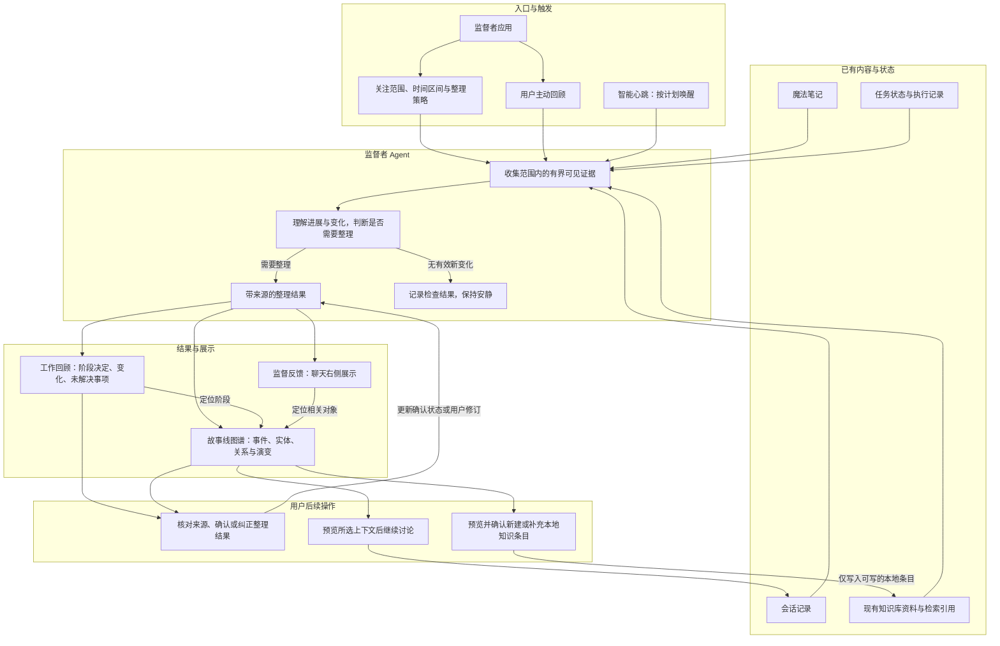
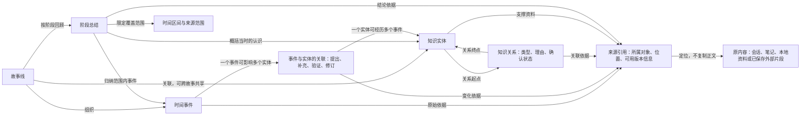

# 监督者逻辑设计

日期：2026-09-23。状态：部分规则已接入产品，验证范围见[实施进度](./progress.md)。图中的连线表示逻辑依赖与数据流，不代表所有目标接口均已实现。

本文承接[监督者产品设计](./supervisor-prd.md)、[故事线图谱设计](../story-graph/prd.md)和[User Stories](./user-stories.md)，定义触发、整理、展示与用户后续操作之间的关系。既有会话监督的证据和介入边界继续由[会话监督 PRD](./prd.md)约束。

## 整体逻辑架构

报告、监督叶子与导航整理共用监督专用 FIFO 并发池，普通聊天不入池；监督服务外层 run 仍串行。报告在排队前冻结超时，获槽后领取，实际模型请求前校验并刷新租约；报告提交或无变化后先释放槽位，再执行监督。监督超时在 run 创建时保存，节点获槽并解析 Runtime 后计时。阶段超时、租约、传输时限、后台检查与活动轮询各自独立，取值及生效规则见[当前设置合同](./review-scheduling-design.md#当前设置合同)。

完整回顾的生产接线已增加分页来源清单、逐批输出/offset 事务和导航节点。预算耗尽显示 `paused`，模型或保存失败显示 `failed`；两者均保留此前成功批次，可继续同一 run。存在未读来源、覆盖空洞或未成功导航时不能标 `completed`。手动位置与自动 checkpoint 分开，自动位置只在最终发布事务推进。来源变更目前要求重新回顾，模型配置跨重启固定等差异见[生产接线与剩余边界](./review-scheduling-design.md#0-生产接线与剩余边界)。真实模型验证覆盖 27 条消息的完整会话，较大样本失败单独记录。

心跳负责唤醒，监督者负责判断；模型不因被称为 Agent 而自动获得工具权限。收集证据由应用按所选范围提供，现有心跳不具备的知识库或笔记接入属于后续工作。

工作回顾、监督反馈和图谱引用同一次整理的结论与来源。展示可以裁剪为阶段摘要、会话卡片或图形，但不能分别维护相互矛盾的结论。一次整理可以没有图谱变更，也可以有整理结果但无需主动通知。

结果定位以结果 ID 为准。历史选择不能回退到其他项目的最新图谱；侧栏需同时匹配目标来源和范围，没有匹配结果时显示空态。固定目标失效时保留目标并显示读取错误，用户可取消固定。跨 run 仅允许引用同 scope 的 Main 候选实体，模型局部 ID 和同名均不构成身份。模型候选引用与存储身份分离；历史文本主键按 Main 精确映射保留，格式错误的旧模型身份字段只产生新实体，不猜测合并对象。每次结果保留当次描述，自动更新不得改写已确认字段或其他结果；人工修改仅更新当前对象与明确选定的结果。

应用维护来源正文；监督者维护其产生的阶段总结、事件关联、实体描述与关系。图谱是这些对象的视图。图中“纠正”只更新整理内容或关系，修改来源正文仍需进入对应应用的编辑流程。

## 图谱对象关系

这里的关联对象用于说明关系自身也有类型和依据，不指定存储表。知识实体与来源为多对多关系；实体可以被多个故事引用，不能仅凭同名就合并。来源可用的版本信息沿用原内容能力，不要求为此复制完整来源历史。

外圈时间轴呈现事件及阶段标记，内部平铺实体；时间到实体的连线对应事件关联，实体间连线对应知识关系。时间轴上的同日聚合点只负责显示密集事件，不形成新的知识实体。

## 应用启停与执行

以下规则对应 FR-S1、FR-S4、FR-S5 和 US-S14，适用于监督者与智能心跳共用的 `heartbeat` 应用。

- 新安装及设置缺失 `heartbeatEnabled` 时按 `false` 处理；已明确保存的 `true`、`false` 均保留。
- 关闭应用后不领取新的定时心跳运行，拒绝新的手动心跳和监督回顾请求，也不启动心跳完成后的自动监督回顾。侧栏不挂载监督面板，不发起该面板的查询。
- 启用应用后，只有已保存且启用的心跳计划才参与自动调度；没有此类计划时不产生自动工作。启动或启用应用不自动创建、补种或启用计划，用户仍可主动发起回顾。
- 关闭前已经领取并在执行的运行可以完成并保存结果，关闭应用不强制取消；若完成时应用已关闭，不再追加自动监督回顾。已有计划的 `enabled`、历史结果及导航偏好保留。
- 应用开关不影响普通任务的现有定时调度。取消常驻只改变导航入口，不改变应用启用或计划状态。

## 状态与处理规则

下表包含目标规则；当前活动执行状态以本节后的“活动记录”为准，取消及部分完成尚未接入。

| 规则 | 条件或状态 | 处理与用户可见结果 | 需求与场景 |
| --- | --- | --- | --- |
| L1 范围 | 手动或定时触发 | 按本次所选范围、时间和输入预算收集证据；启用应用不扩大来源范围 | FR-S3、S4；US-S01 |
| L2 检查 | 没有有效新变化 | 记录检查结果，保留旧回顾，不重复通知；用户主动查看时仍可读取原结果 | FR-S4、S5；US-S03 |
| L3 整理 | 产生新的阶段认识或关联 | 回顾、反馈和图谱引用同一整理结果；是否主动反馈按反馈策略决定 | FR-S2、S5；US-S02、S04 |
| L4 失败 | 取消、失败或部分来源不可用 | 保留上次成功结果；显示当前运行状态、已覆盖与遗漏范围，支持重试；部分结果不标为完整 | FR-S6；US-S12 |
| L5 纠正 | 用户修改描述或确认关系 | 后续自动整理提出补充或修订建议，不静默覆盖用户内容；移除关系可撤销且不删除来源 | FR-S6、S9、FR-G4；US-S06、S10 |
| L6 历史 | 选择过去时刻或时间区间 | 使用当时已有的事件与认识；来源旧版不可恢复时提示，不以当前原文冒充旧版 | FR-S9、FR-G3、G5；US-S05、S07、S13 |
| L7 目标 | 侧栏跟随或固定 | 跟随时显示当前会话，固定时保持所选目标；切换聊天不改变固定目标 | FR-S5；US-S25 |
| L8 沉淀 | 用户选择写入知识库 | 先预览并确认，再新建或补充本地条目；已有条目提供打开入口，外部引用保持只读 | FR-S7、S8；US-S08、S09 |
| L9 继续 | 用户选择继续讨论 | 预览并确认上下文后进入会话；新内容在后续整理时纳入，不立即作为已确认知识 | FR-S3、S5；US-S11 |
| L10 展示 | 改变布局或输入方式 | 保留范围、回放时刻及选择；图形和文字列表访问相同对象与来源 | FR-G2、G5、G6；US-S15 |

整理运行状态与内容确认状态分开：一次运行成功不意味着自动归纳已经得到用户确认。手动重试创建新运行；心跳继续沿用原有运行领取和重试规则。

## 活动记录

对应 FR-S10、US-S26。监督运行在收集证据之前保存 `running`，结果事务成功后转为 `completed`；收集、模型、校验或保存失败转为 `failed`，保留错误及结束时间。重开应用将没有完成的监督运行标为失败，旧成功结果保持可读。

心跳活动按真实运行 ID 关联下游监督。报告阶段使用 `claimed / completed / failed / skipped / no_change`，活动将 `claimed` 显示为运行中。报告已结束而投影尚在执行时，整条活动仍为运行中；任一阶段失败，整条活动显示失败。两阶段都没有新输入时显示“无变化（未调用模型）”；任一阶段保存新结果且没有失败时显示完成。没有下游运行记录时明确显示“无执行记录”。

旧监督成功记录继续显示；旧心跳与监督之间未保存关联时分别呈现，不用时间接近猜测关系。旧心跳未保存的执行范围显示不可用，不从当前计划反推。此前未保存的手动运行与失败无法恢复。心跳报告沿用计划的历史保留和删除规则；监督结果独立保留，原心跳被清理后仍可读取监督记录。活动不是永久审计库。

当前活动没有 `cancelled` 或 `partial` 状态，也不提供取消按钮。实体和关系修改只有当前状态及结果内容，没有按时间追加的人工修改记录。

收集、叶子整理、导航合并和发布分别展示。阶段推进只依据服务记录，最终完成只依据结果事务；“六批已保存、剩余零来源”仍可处于合并失败或发布失败。继续保留成功叶子和导航节点，缺失阶段不得靠错误文本或来源数猜测。导航摘要允许省略事实数组，叶子缺少事实数组仍失败；导航不得生成替代叶子事实的非空数组。阶段及输出合同见[生产调度](./review-scheduling-design.md#已接入的调度与存储)。

### 自动增量与手动重看

自动心跳报告和下游监督分别记录已成功处理的来源版本及正文位置。首次自动运行只读取计划范围和回顾窗口内的来源；后续运行在同样边界内处理新增、修订或上次预算未覆盖的片段。项目列表顺序不改变自动进度；不同项目集合和 Global 分开处理。失败、未送入模型或结果事务未提交的输入保留待处理状态。

两个阶段都在调用模型前检查输入。没有待处理来源时记录 `no_change`，保留旧报告和图谱，不产生新结果或重复事件。心跳报告无变化仍进入受应用开关控制的下游检查，允许监督阶段重试之前的失败。已确认记忆、已有实体说明及最近摘要仅作为背景，不单独触发自动模型调用。

工作回顾的手动操作重新整理所选区间，沿用有界历史收集，不读取或推进自动进度。自动监督计划列表中的“立即运行”重新生成心跳报告，其下游监督仍按自动进度处理。删除报告或计划不重置来源进度；重看历史、删除报告和重建图谱是不同操作。当前没有清空或重建图谱功能。

计划 Modal 的新建草稿不产生持久化或执行副作用，显式保存时创建并启用；编辑沿用已有 enabled。保存失败保留草稿，提交期间禁止关闭，未保存关闭须确认。活动筛选只改变读取范围，不触发执行；同名同范围计划仍按 configId 区分，筛选在分页前应用，结果跳转继续按 resultId 定位。

规则冲突时，先满足所选范围与既有观察边界，再保留用户修订和来源事实，最后应用自动归纳和展示策略。新增证据与已确认结论冲突时显示待核对差异，不能自动断言旧观点失效。

## 完整性与待定项

本设计覆盖触发、证据输入、静默检查、正常整理、取消与失败、跨视图共享结果、用户纠正、知识库写入及历史回放。它补充产品逻辑，不代表接口、持久化或迁移方案已经完成。

仍待产品决策：事件触发与阶段识别条件、反馈频率与静默判定、实体合并与拆分的交互、时间轴比例和集中度含义。应用启停按[应用启停与执行](#应用启停与执行)处理；既有入口偏好、计划与运行记录的保留要求见 FR-S1、S2 和 US-S14。

来源旧版本和完整历史回放仍受原应用的保存能力限制。增量进度与同 scope 实体 ID 复用的实现见[技术设计](./technical-design.md#自动增量收集)。
