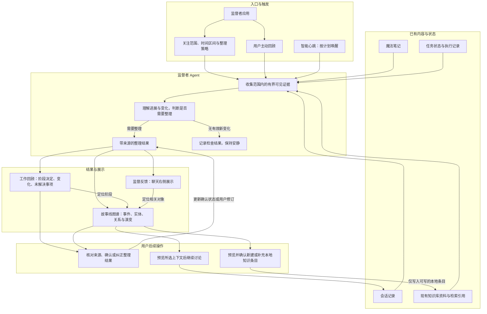
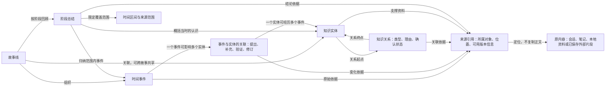

# 监督者逻辑设计

日期：2026-09-16。状态：目标设计，尚未接入产品。图中的连线表示逻辑依赖与数据流，不代表已实现的调用接口或数据库结构。

本文承接[监督者产品设计](./supervisor-prd.md)、[故事线图谱设计](../story-graph/prd.md)和[User Stories](./user-stories.md)，定义触发、整理、展示与用户后续操作之间的关系。既有会话监督的证据和介入边界继续由[会话监督 PRD](./prd.md)约束。

## 整体逻辑架构

心跳负责唤醒，监督者负责判断；模型不因被称为 Agent 而自动获得工具权限。收集证据由应用按所选范围提供，现有心跳不具备的知识库或笔记接入属于后续工作。

工作回顾、监督反馈和图谱引用同一次整理的结论与来源。展示可以裁剪为阶段摘要、会话卡片或图形，但不能分别维护相互矛盾的结论。一次整理可以没有图谱变更，也可以有整理结果但无需主动通知。

应用维护来源正文；监督者维护其产生的阶段总结、事件关联、实体描述与关系。图谱是这些对象的视图。图中“纠正”只更新整理内容或关系，修改来源正文仍需进入对应应用的编辑流程。

## 图谱对象关系

这里的关联对象用于说明关系自身也有类型和依据，不指定存储表。知识实体与来源为多对多关系；实体可以被多个故事引用，不能仅凭同名就合并。来源可用的版本信息沿用原内容能力，不要求为此复制完整来源历史。

外圈时间轴呈现事件及阶段标记，内部平铺实体；时间到实体的连线对应事件关联，实体间连线对应知识关系。时间轴上的同日聚合点只负责显示密集事件，不形成新的知识实体。

## 状态与处理规则

| 规则 | 条件或状态 | 处理与用户可见结果 | 需求与场景 |
| --- | --- | --- | --- |
| L1 范围 | 手动或定时触发 | 按本次所选范围、时间和输入预算收集证据；启用应用不扩大来源范围 | FR-S3、S4；US-S01 |
| L2 检查 | 没有有效新变化 | 记录检查结果，保留旧回顾，不重复通知；用户主动查看时仍可读取原结果 | FR-S4、S5；US-S03 |
| L3 整理 | 产生新的阶段认识或关联 | 回顾、反馈和图谱引用同一整理结果；是否主动反馈按反馈策略决定 | FR-S2、S5；US-S02、S04 |
| L4 失败 | 取消、失败或部分来源不可用 | 保留上次成功结果；显示当前运行状态、已覆盖与遗漏范围，支持重试；部分结果不标为完整 | FR-S6；US-S12 |
| L5 纠正 | 用户修改描述或确认关系 | 后续自动整理提出补充或修订建议，不静默覆盖用户内容；移除关系可撤销且不删除来源 | FR-S6、S9、FR-G4；US-S06、S10 |
| L6 历史 | 选择过去时刻或时间区间 | 使用当时已有的事件与认识；来源旧版不可恢复时提示，不以当前原文冒充旧版 | FR-S9、FR-G3、G5；US-S05、S07、S13 |
| L7 目标 | 侧栏跟随或固定 | 跟随时显示当前会话，固定时保持所选目标；切换聊天不改变固定目标 | FR-S5；US-S02 |
| L8 沉淀 | 用户选择写入知识库 | 先预览并确认，再新建或补充本地条目；已有条目提供打开入口，外部引用保持只读 | FR-S7、S8；US-S08、S09 |
| L9 继续 | 用户选择继续讨论 | 预览并确认上下文后进入会话；新内容在后续整理时纳入，不立即作为已确认知识 | FR-S3、S5；US-S11 |
| L10 展示 | 改变布局或输入方式 | 保留范围、回放时刻及选择；图形和文字列表访问相同对象与来源 | FR-G2、G5、G6；US-S15 |

整理运行状态与内容确认状态分开：一次运行成功不意味着所有自动归纳均已被用户确认。运行从待处理进入整理中，再结束为成功、无新变化、部分完成、失败或已取消；重试作为新一次整理显示，不能将失败运行改称成功。具体运行标识与现有心跳状态如何映射留待技术设计。

规则冲突时，先满足所选范围与既有观察边界，再保留用户修订和来源事实，最后应用自动归纳和展示策略。新增证据与已确认结论冲突时显示待核对差异，不能自动断言旧观点失效。

## 完整性与待定项

本设计覆盖触发、证据输入、静默检查、正常整理、取消与失败、跨视图共享结果、用户纠正、知识库写入及历史回放。它补充产品逻辑，不代表接口、持久化或迁移方案已经完成。

仍待产品决策：停用应用时计划及运行中任务的处理方式、事件触发与阶段识别条件、反馈频率与静默判定、实体合并与拆分的交互、时间轴比例和集中度含义。既有入口偏好、计划与运行记录的保留要求见 FR-S1、S2 和 US-S14。

技术设计需确认现有实体标识能否复用、来源定位与历史版本可用性、增量整理和并发运行如何避免重复结果、已有心跳计划如何兼容。按照现有能力选择最小实现，不预设新的历史快照、恢复框架或独立知识存储。
