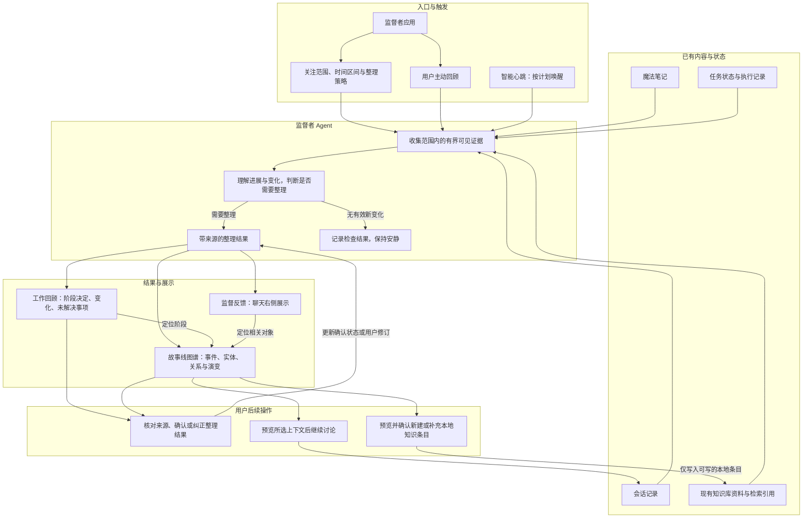
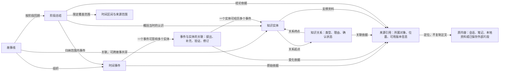

# 监督者逻辑设计

日期：2026-09-23。状态：部分规则已接入产品，验证范围见[实施进度](./progress.md)。图中的连线表示逻辑依赖与数据流，不代表所有目标接口均已实现。

本文承接[监督者产品设计](./supervisor-prd.md)、[故事线图谱设计](../story-graph/prd.md)和[User Stories](./user-stories.md)，定义触发、整理、展示与用户后续操作之间的关系。既有会话监督的证据和介入边界继续由[会话监督 PRD](./prd.md)约束。

## 监督者模型选择

对应 FR-S13。监督者可跟随应用默认文本模型，或固定使用一个已保存的文本模型连接；会话和项目的 Runtime 选择不影响它。提取、导航汇总、故事归属、经验整理及建议措辞均使用监督者的模型设置。

回顾获得执行位置后，读取一次连接配置；同次执行中的批次、输出重试、汇总、故事与经验阶段保持该模型。修改监督者选择、应用默认模型或连接配置，仅影响后续执行。继续暂停或失败的回顾、单独重试故事、生成或重试建议时重新读取当前选择；跨重启不保存模型或凭据快照。显式选择的连接被删除、改为图片协议或缺少所需 API Key 时，执行报错并提示修改设置，不自动换成默认模型。

对应 FR-S6。监督模型遇到可识别的临时失败时，统一等待 500ms 后重试一次：HTTP 429、500／502／503／504，以及短暂网络故障或响应流中断。取消、模型超时、认证、配置、额度或容量错误直接停止；无法确认可恢复的错误也不重试。失败尝试的部分正文丢弃，已报告用量和已保存批次保留。叶子输出校验后的缩块重试、导航输出重试保持原规则；请求生命周期见[模型阶段超时与调度](./technical-design.md#模型阶段超时与调度)。

## 整体逻辑架构

报告、监督叶子与导航整理共用监督专用 FIFO 并发池，普通聊天不入池；监督服务外层 run 仍串行。报告在排队前冻结超时，获槽后领取，实际模型请求前校验并刷新租约；报告提交或无变化后先释放槽位，再执行监督。监督超时在 run 创建时保存，节点获槽并解析 Runtime 后计时。阶段超时、租约、传输时限、后台检查与活动轮询各自独立，取值及生效规则见[当前设置合同](./review-scheduling-design.md#当前设置合同)。

完整回顾的生产接线已增加分页来源清单、逐批输出/offset 事务和导航节点。用户主动暂停后显示 `paused`，模型或保存失败显示 `failed`；两者均保留此前成功批次，可继续同一 run。回顾不按累计运行时长自动暂停。存在未读来源、覆盖空洞或未成功导航时不能标 `completed`。手动位置与自动 checkpoint 分开，自动位置只在最终发布事务推进。现存来源修改仍要求重新回顾；会话删除按下节规则省略。其他差异见[生产接线与剩余边界](./review-scheduling-design.md#0-生产接线与剩余边界)。真实模型验证覆盖 27 条消息的完整会话，较大样本失败单独记录。

### 未发布回顾遇到会话删除

对应 FR-S9、US-S35。会话物理删除后，尚未发布的回顾省略其冻结来源，继续处理其他会话；省略包含消息、消息携带的知识引用及已记录会话归属的任务。归档不等同于删除，现存来源修改、单独消息移除或其他不可用原因仍明确失败。初始化前已删除的会话不进入清单。

含删除来源的叶子整批丢弃，其父级导航失效。混合批次中的存活来源从本次初始 offset 重做，包含这些来源的其他批次也失效，避免覆盖空洞或重复事实；与之无关的批次及导航保留。不从保存片段恢复或重读已删除会话。

活动及运行详情显示省略来源数；完成仅表示保留来源已处理并发布，不代表原冻结集合全部覆盖。所有来源均被省略时记录 `no_change`，不生成空报告、不推进这些来源的 checkpoint。删除前已发布的结果、事实和历史片段保留规则不变。已发出的模型请求可能仍返回，但其受影响输出不得发布。


```mermaid
flowchart TB
    subgraph Entry["入口与触发"]
        App["监督者应用"]
        Scope["关注范围、时间区间与整理策略"]
        Manual["用户主动回顾"]
        Heartbeat["智能心跳：按计划唤醒"]
    end

    subgraph Sources["已有内容与状态"]
        Conversation["会话记录"]
        Notes["魔法笔记"]
        Work["任务状态与执行记录"]
        Knowledge["现有知识库资料与检索引用"]
    end

    subgraph Supervisor["监督者 Agent"]
        Collect["收集范围内的有界可见证据"]
        Review["理解进展与变化，判断是否需要整理"]
        Result["带来源的整理结果"]
        Quiet["记录检查结果，保持安静"]
    end

    subgraph Outputs["结果与展示"]
        Recap["工作回顾：阶段决定、变化、未解决事项"]
        Feedback["监督反馈：聊天右侧展示"]
        Graph["故事线图谱：事件、实体、关系与演变"]
    end

    subgraph Actions["用户后续操作"]
        Verify["核对来源、确认或纠正整理结果"]
        Continue["预览所选上下文后继续讨论"]
        Save["预览并确认新建或补充本地知识条目"]
    end

    App --> Scope
    App --> Manual
    Scope --> Collect
    Manual --> Collect
    Heartbeat --> Collect
    Conversation --> Collect
    Notes --> Collect
    Work --> Collect
    Knowledge --> Collect
    Collect --> Review
    Review -->|需要整理| Result
    Review -->|无有效新变化| Quiet
    Result --> Recap
    Result --> Feedback
    Result --> Graph
    Recap -->|定位阶段| Graph
    Feedback -->|定位相关对象| Graph
    Recap --> Verify
    Graph --> Verify
    Verify -->|更新确认状态或用户修订| Result
    Graph --> Continue
    Continue --> Conversation
    Graph --> Save
    Save -->|仅写入可写的本地条目| Knowledge
```

心跳负责唤醒，监督者负责判断；模型不因被称为 Agent 而自动获得工具权限。收集证据由应用按所选范围提供，现有心跳不具备的知识库或笔记接入属于后续工作。

工作回顾、监督反馈和图谱引用同一次整理的结论与来源。展示可以裁剪为阶段摘要、会话卡片或图形，但不能分别维护相互矛盾的结论。一次整理可以没有图谱变更，也可以有整理结果但无需主动通知。

结果定位以结果 ID 为准。历史选择不能回退到其他项目的最新图谱；侧栏需同时匹配目标来源和范围，没有匹配结果时显示空态。固定目标失效时保留目标并显示读取错误，用户可取消固定。跨 run 仅允许引用同 scope 的 Main 候选实体，模型局部 ID 和同名均不构成身份。模型候选引用与存储身份分离；历史文本主键按 Main 精确映射保留，格式错误的旧模型身份字段只产生新实体，不猜测合并对象。每次结果保留当次描述，自动更新不得改写已确认字段或其他结果；人工修改仅更新当前对象与明确选定的结果。

应用维护来源正文；监督者维护其产生的阶段总结、事件关联、实体描述与关系。图谱是这些对象的视图。图中“纠正”只更新整理内容或关系，修改来源正文仍需进入对应应用的编辑流程。

## 图谱对象关系


```mermaid
flowchart LR
    Story["故事线"]
    Event["时间事件"]
    Change["事件与实体的关联：提出、补充、验证、修订"]
    Entity["知识实体"]
    Relation["知识关系：类型、理由、确认状态"]
    Summary["阶段总结"]
    Interval["时间区间与来源范围"]
    Reference["来源引用：所属对象、位置、可用版本信息"]
    Original["原内容：会话、笔记、本地资料或已保存外部片段"]

    Story -->|组织| Event
    Story -->|关联，可跨故事共享| Entity
    Story -->|按阶段回顾| Summary
    Summary -->|限定覆盖范围| Interval
    Summary -->|归纳范围内事件| Event
    Summary -->|概括当时的认识| Entity
    Event -->|一个事件可影响多个实体| Change
    Change -->|一个实体可经历多个事件| Entity
    Entity -->|关系起点| Relation
    Relation -->|关系终点| Entity
    Event -->|原始依据| Reference
    Change -->|变化依据| Reference
    Relation -->|关联依据| Reference
    Entity -->|支撑资料| Reference
    Summary -->|结论依据| Reference
    Reference -->|定位，不复制正文| Original
```

这里的关联对象用于说明关系自身也有类型和依据，不指定存储表。知识实体与来源为多对多关系；实体可以被多个故事引用，不能仅凭同名就合并。来源可用的版本信息沿用原内容能力，不要求为此复制完整来源历史。

外圈时间轴呈现事件及阶段标记，内部平铺实体；时间到实体的连线对应事件关联，实体间连线对应知识关系。时间轴上的同日聚合点只负责显示密集事件，不形成新的知识实体。

## 应用启停与执行

以下规则对应 FR-S1、FR-S4、FR-S5 和 US-S14，适用于监督者与智能心跳共用的 `heartbeat` 应用。

- 新安装及设置缺失 `heartbeatEnabled` 时按 `false` 处理；已明确保存的 `true`、`false` 均保留。
- 关闭应用后不领取新的定时心跳运行，拒绝新的手动心跳和监督回顾请求，也不启动心跳完成后的自动监督回顾。侧栏不挂载监督面板，不发起该面板的查询。
- 启用应用后，只有已保存且启用的心跳计划才参与自动调度；没有此类计划时不产生自动工作。启动或启用应用不自动创建、补种或启用计划，用户仍可主动发起回顾。
- 关闭前已经领取并在执行的运行可以完成并保存结果，关闭应用不强制取消；若完成时应用已关闭，不再追加自动监督回顾。已有计划的 `enabled`、历史结果及导航偏好保留。
- 应用开关不影响普通任务的现有定时调度。取消常驻只改变导航入口，不改变应用启用或计划状态。

## 状态与处理规则

下表包含目标规则；当前活动执行状态以本节后的“活动记录”为准，取消已接入，部分完成状态尚未接入。

| 规则 | 条件或状态 | 处理与用户可见结果 | 需求与场景 |
| --- | --- | --- | --- |
| L1 范围 | 手动或定时触发 | 按本次所选范围、时间和输入预算收集证据；启用应用不扩大来源范围 | FR-S3、S4；US-S01 |
| L2 检查 | 没有有效新变化 | 记录检查结果，保留旧回顾，不重复通知；用户主动查看时仍可读取原结果 | FR-S4、S5；US-S03 |
| L3 整理 | 产生新的阶段认识或关联 | 回顾、反馈和图谱引用同一整理结果；是否主动反馈按反馈策略决定 | FR-S2、S5；US-S02、S04 |
| L4 失败 | 取消、失败或部分来源不可用 | 保留上次成功结果；显示当前运行状态、已覆盖与遗漏范围，支持重试；部分结果不标为完整 | FR-S6；US-S12 |
| L5 纠正 | 用户修改描述或确认关系 | 后续自动整理提出补充或修订建议，不静默覆盖用户内容；移除关系可撤销且不删除来源 | FR-S6、S9、FR-G4；US-S06、S10 |
| L6 历史 | 选择过去时刻或时间区间 | 使用当时已有的事件与认识；来源旧版不可恢复时提示，不以当前原文冒充旧版 | FR-S9、FR-G3、G5；US-S05、S07、S13 |
| L7 目标 | 侧栏跟随或固定 | 跟随时显示当前会话，固定时保持所选目标；切换聊天不改变固定目标 | FR-S5；US-S25 |
| L8 沉淀 | 用户选择写入知识库 | 先预览并确认，再新建或补充本地条目；已有条目提供打开入口，外部引用保持只读 | FR-S7、S8；US-S08、S09 |
| L9 继续 | 用户选择继续讨论 | 预览并确认上下文后进入会话；新内容在后续整理时纳入，不立即作为已确认知识 | FR-S3、S5；US-S11 |
| L10 展示 | 改变布局或输入方式 | 保留范围、回放时刻及选择；图形和文字列表访问相同对象与来源 | FR-G2、G5、G6；US-S15 |

整理运行状态与内容确认状态分开：一次运行成功不意味着自动归纳已经得到用户确认。手动重试创建新运行；心跳继续沿用原有运行领取和重试规则。

## 活动记录

对应 FR-S10、US-S26。监督运行在收集证据之前保存 `running`，结果事务成功后转为 `completed`；收集、模型、校验或保存失败转为 `failed`，保留错误及结束时间。重开应用将没有完成的监督运行标为失败，旧成功结果保持可读。

心跳活动按真实运行 ID 关联下游监督。报告阶段使用 `claimed / completed / failed / skipped / no_change`，活动将 `claimed` 显示为运行中。报告已结束而投影尚在执行时，整条活动仍为运行中；任一阶段失败，整条活动显示失败。两阶段都没有新输入时显示“无变化（未调用模型）”；任一阶段保存新结果且没有失败时显示完成。没有下游运行记录时明确显示“无执行记录”。

旧监督成功记录继续显示；旧心跳与监督之间未保存关联时分别呈现，不用时间接近猜测关系。旧心跳未保存的执行范围显示不可用，不从当前计划反推。此前未保存的手动运行与失败无法恢复。心跳报告沿用计划的历史保留和删除规则；监督结果独立保留，原心跳被清理后仍可读取监督记录。活动不是永久审计库。

同一时刻只允许一个监督回顾执行，包括停止清理阶段；不同 scope 也共用此限制。手动新建或继续遇到占用时立即提示，不排队；自动回顾等待占用释放，再检查未完成运行和增量来源。暂停或失败后可以新建回顾，也可继续有效的原 run。

取消立即持久化 `cancelled`，但执行与清理尚未停止时 UI 显示“正在取消”，此时仍不能开始另一个回顾。停止后显示“已取消”，保留上次成功结果和本次已保存批次，不发布部分结果、不推进自动 checkpoint。已取消运行不能手动继续，自动检查也不恢复它；后续自动检查可新建 run 处理尚未提交的来源。关联心跳活动显示监督取消状态，已保存的报告保持原状态。界面入口及提示关闭规则见[UI 设计](./ui-design.md#活动)。当前没有 `partial` 状态；实体和关系修改仍没有按时间追加的人工修改记录。

收集、叶子整理、导航合并和发布分别展示。阶段推进只依据服务记录，最终完成只依据结果事务；“六批已保存、剩余零来源”仍可处于合并失败或发布失败。继续保留成功叶子和导航节点，缺失阶段不得靠错误文本或来源数猜测。导航摘要允许省略事实数组，叶子缺少事实数组仍失败；导航不得生成替代叶子事实的非空数组。阶段及输出合同见[生产调度](./review-scheduling-design.md#已接入的调度与存储)。

### 自动增量与手动重看

自动心跳报告和下游监督分别记录已成功处理的来源版本及正文位置。首次自动运行只读取计划范围和回顾窗口内的来源；后续运行在同样边界内处理新增、修订或上次预算未覆盖的片段。项目列表顺序不改变自动进度；不同项目集合和 Global 分开处理。失败、未送入模型或结果事务未提交的输入保留待处理状态。

两个阶段都在调用模型前检查输入。没有待处理来源时记录 `no_change`，保留旧报告和图谱，不产生新结果或重复事件。心跳报告无变化仍进入受应用开关控制的下游检查，允许监督阶段重试之前的失败。已确认记忆、已有实体说明及最近摘要仅作为背景，不单独触发自动模型调用。

工作回顾的手动操作重新整理所选区间，沿用有界历史收集，不读取或推进自动进度。自动监督计划列表中的“立即运行”重新生成心跳报告，其下游监督仍按自动进度处理。删除报告或计划不重置来源进度；重看历史、删除报告和重建图谱是不同操作。当前没有清空或重建图谱功能。

回顾默认增量，重看历史改为显式重新整理。

### 心跳职责与介入（目标设计）

对应 FR-S4、FR-S12，US-S27、US-S32、US-S33。本节为已确认的目标规则，尚未实现；当前代码仍先生成心跳报告再执行监督整理，实际进度以[实施进度](./progress.md)为准。“回顾”默认增量，重看历史改为显式“重新整理”。

### 心跳职责与介入（目标设计）

对应 FR-S4、FR-S12，US-S27、US-S32、US-S33。本节为已确认的目标规则，尚未实现；当前代码仍先生成心跳报告再执行监督整理，实际进度以[实施进度](./progress.md)为准。

回顾整理只有一套流程，手动和自动共用：确定范围 → 分页采集来源 → 分批整理 → 汇总 → 发布到 Story Graph。心跳不参与整理本身，只在其外增加两件事：

1. **定时触发**：计划到期时代替用户发起一次增量回顾。
2. **介入**：回顾发布后，按计划配置的介入方式处理本次图谱变化。

```text
触发（点击“回顾” / 计划到期）
  ↓
变化检查：比较来源版本与已处理位置，不调用模型
  ↓ 无变化 → 记录“无新变化”，结束
  ↓ 有变化
增量整理：只处理新增、修订和未完成片段，关联已有实体（唯一读取原文的阶段）
  ↓
发布：写入 Story Graph，推进增量进度
  ↓ 仅心跳触发
介入：读取本次发布的图谱变化，按计划配置生成建议
```

| 规则 | 内容 |
| --- | --- |
| H1 原文只读一次 | 同一来源版本在一次触发中只由整理阶段读取；介入阶段的输入是本次图谱变化及其来源引用，不重新读取原文 |
| H2 不再生成独立报告 | 取消“心跳报告”阶段及其独立增量进度；旧报告只读保留，不再新建 |
| H3 手动默认增量 | “回顾”按钮与心跳整理行为一致，跳过已处理且未变化的来源；手动触发不生成建议 |
重新整理放在更多中，确认后重新分析所选时间区间；不推进也不重置自动进度，不覆盖用户确认内容 |“重新整理”放在“更多”中，确认后重新分析所选时间区间；不推进也不重置自动进度，不覆盖用户确认内容 |
| H5 介入方式 | 计划字段：`仅更新记忆`、`生成建议`（新计划默认）、`主动介入`（会话级实时，暂不实现，不显示为可选项） |
| H6 建议来源 | 候选仅来自本次图谱变化：批次中的未解决事项、无明确取代关系的分歧（contrasts 关系）、由至少三处不同原始来源支持的未确认实体（候选约定）、被修订的实体（revised 变化）。长期未推进的判定尚未实现 |
| H7 建议成本 | 先按规则挑选候选，不调用模型；存在候选时才发起一次输入有界的措辞调用，输入仅为候选及其引用 |
| H8 建议可信 | 每条建议显示依据并可打开来源；用户忽略后，只有出现新证据才再次提出；确认候选约定或偏好后才作为长期背景 |
| H9 频率与成本 | 提高频率只增加变化检查次数；模型调用次数由实际变化决定：无变化 0 次，有变化无候选仅整理，有候选再加一次建议调用 |
| H10 失败隔离 | 建议阶段失败不回滚已发布的图谱与增量进度；活动显示“已更新，建议生成失败”，可单独重试建议 |

介入产物替代旧心跳的报告、记忆建议与行动建议：未解决事项可转任务，候选约定确认后进入长期背景，旧的报告阅读由按时间查看图谱变化替代。已有计划的范围、频率和启停状态保留，迁移后介入方式默认为“生成建议”；已确认记忆与待处理建议保留并逐步迁入，不补造来源。

计划 Modal 的新建草稿不产生持久化或执行副作用，显式保存时创建并启用；编辑沿用已有 enabled。保存失败保留草稿，提交期间禁止关闭，未保存关闭须确认。活动筛选只改变读取范围，不触发执行；同名同范围计划仍按 configId 区分，筛选在分页前应用，结果跳转继续按 resultId 定位。

规则冲突时，先满足所选范围与既有观察边界，再保留用户修订和来源事实，最后应用自动归纳和展示策略。新增证据与已确认结论冲突时显示待核对差异，不能自动断言旧观点失效。

## 完整性与待定项

FR-S11、US-S30 的会话故事图谱开关规则见 [MCP 接入合同第 6 节](./story-graph-mcp-design.md#6-内置-mcp-与-runtime-接入)。应用启用、会话允许和 Runtime 能力分配须同时满足；回顾是否自动运行不由会话读取开关控制。

FR-S11、US-S28 至 US-S31 的规则由[时态 Story Graph MCP 设计](./story-graph-mcp-design.md)统一定义：时间／确认与有效性见第 3 节，读取范围与分页见第 4 节，应用关闭与 Runtime 接入见第 6 节，跨 scope 复用与记忆过渡见第 7、8 节。D1 读取已接入，后两项仍待实现；Global／项目独立 checkpoint 和同 scope 候选身份保留。MCP 不接受 `as_of`，较晚生成的结果也不自动使旧决定失效。

本设计覆盖触发、证据输入、静默检查、正常整理、取消与失败、跨视图共享结果、用户纠正、知识库写入及历史回放。它补充产品逻辑，不代表接口、持久化或迁移方案已经完成。

仍待产品决策：事件触发与阶段识别条件、反馈频率与静默判定、实体合并与拆分的交互、时间轴比例和集中度含义。应用启停按[应用启停与执行](#应用启停与执行)处理；既有入口偏好、计划与运行记录的保留要求见 FR-S1、S2 和 US-S14。

来源旧版本和完整历史回放仍受原应用的保存能力限制。增量进度与同 scope 实体 ID 复用的实现见[技术设计](./technical-design.md#自动增量收集)。
