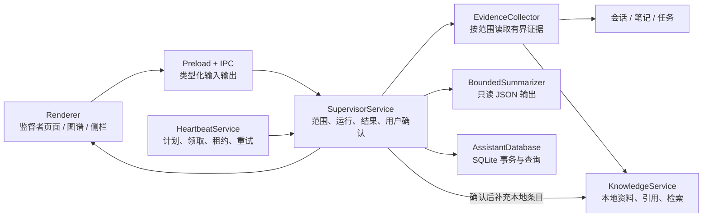
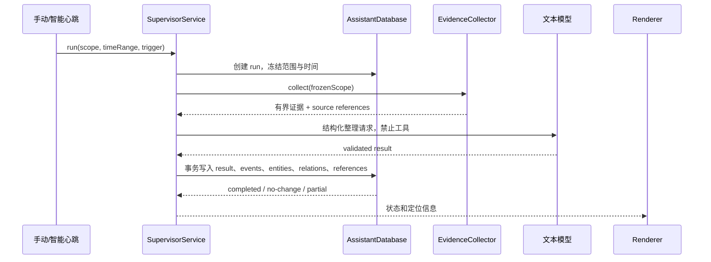
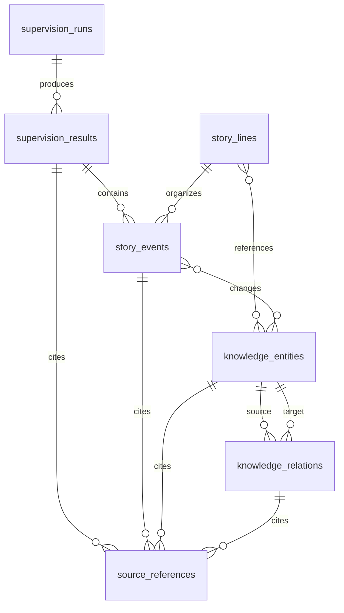

# 监督者技术设计

## 文档信息

| 项目 | 内容 |
| --- | --- |
| 状态 | 目标技术设计，尚未实现 |
| 日期 | 2026-09-20 |
| 产品设计 | [监督者应用产品设计](./supervisor-prd.md) |
| 行为规则 | [监督者逻辑设计](./logic-design.md) |
| 界面设计 | [监督者 UI 设计](./ui-design.md) |
| 实施进度 | 尚未建立，首个实现阶段完成后补充 |

本文回答如何在现有 GoodBuddy 桌面端中实现监督者。它不改变产品范围，也不把模拟 Demo 当作生产数据模型。

## 1. 总体方案

监督者作为 Main 进程中的一个领域服务，复用现有智能心跳的计划、运行领取、租约、重试和有界模型调用。图谱是监督者整理结果的查询视图，知识库继续拥有资料正文、索引和检索。

职责边界如下：

| 模块 | 负责 | 不负责 |
| --- | --- | --- |
| `HeartbeatService` | 计划、到期运行、租约、重试、已有报告兼容 | 图谱实体合并、用户确认、知识库写入编排 |
| `SupervisorService` | 触发统一、证据收集、整理结果、图谱查询和修订 | 自己实现调度器、复制来源正文 |
| `EvidenceCollector` | 按冻结范围读取会话、笔记、任务、知识库引用 | 越过范围读取全部数据、调用工具 |
| `SupervisorSummarizer` | 以有界输入调用文本模型并解析结构化输出 | 执行工具、直接修改知识库 |
| `AssistantDatabase` | 事务、外键、分页、状态和来源定位持久化 | 生成模型内容 |
| `KnowledgeService` | 资料和本地知识条目的维护、检索及引用 | 管理监督者事件和关系 |
| Renderer | 展示和发起用户操作 | 访问 SQLite、决定权限或拼接 SQL |

## 2. 运行路径

手动回顾和心跳回顾必须经过同一个 `SupervisorService.run()`，只在触发来源上区分。这样可以保证两者使用相同的范围校验、输入预算、输出契约、结果状态和来源处理。

运行状态与内容确认状态分开保存：

- 运行状态：`pending`、`claimed`、`completed`、`no_change`、`partial`、`failed`、`cancelled`。
- 内容状态：来源事实、自动归纳、待核对、用户确认、用户修订、已移除关系。
- 运行成功只表示模型结果已按契约保存，不表示所有实体和关系已经被用户确认。
- 失败或取消保留上次成功结果；部分结果必须带覆盖范围和遗漏原因。

## 3. 数据模型

首版使用现有 `AssistantDatabase` 和同一 SQLite 数据库。新增表保持领域对象独立，但不复制会话、笔记或知识库正文。

建议的最小持久化对象：

| 对象 | 关键字段 | 说明 |
| --- | --- | --- |
| `supervision_runs` | `id`, `trigger`, `scope_json`, `time_range_json`, `status`, `error`, `started_at`, `completed_at` | 一次手动或心跳整理；保存冻结范围，不从当前配置回推历史 |
| `supervision_results` | `id`, `run_id`, `summary`, `change_digest`, `coverage_json` | 工作回顾、监督反馈和图谱共同读取的结果版本 |
| `story_lines` | `id`, `scope_json`, `title`, `created_at`, `updated_at` | 用户选择的工作故事线，不等同于 Project |
| `story_events` | `id`, `story_line_id`, `result_id`, `occurred_at`, `title`, `description`, `event_type`, `confidence` | 时间轴上的事件；同日聚合只在查询或 UI 层处理 |
| `knowledge_entities` | `id`, `canonical_label`, `description`, `state`, `confirmation_state`, `updated_at` | 可被多条故事线引用的持续认识，不与知识库文档一一对应 |
| `entity_changes` | `event_id`, `entity_id`, `change_type`, `description`, `confirmation_state` | 表达提出、补充、验证和修订，避免覆盖实体正文 |
| `knowledge_relations` | `id`, `from_entity_id`, `to_entity_id`, `relation_type`, `reason`, `confirmation_state` | 关系独立拥有状态和来源；移除关系不删除来源 |
| `source_references` | `id`, `owner_type`, `owner_id`, `source_type`, `source_id`, `locator_json`, `availability` | 只保存来源标识和有界定位，不复制正文 |

外键和索引要求：

- 所有监督者对象使用 UUID；实体、来源和关系通过稳定 ID 关联，不能只按名称合并。
- `supervision_runs` 按 `created_at`、`scope` 查询；事件按 `story_line_id, occurred_at` 查询。
- 关系对 `(from_entity_id, to_entity_id, relation_type)` 建唯一约束，允许同一实体对存在不同关系类型。
- 删除故事线只删除其组织关系，不删除共享实体、来源或知识库资料；删除知识库资料后来源标为不可用。
- 整理结果、实体变化、关系变化和来源引用在同一 SQLite 事务中提交，提交失败全部回滚。
- 早期不建立完整内容快照或独立向量索引；历史能力只依赖已保存的整理结果和原来源可用性。

模型输出使用版本化共享契约，至少包含 `events`、`entities`、`entityChanges`、`relations`、`summary`、`openItems` 和每项的 `sourceReferenceIds`。Main 必须做数量、字符、枚举、ID 所属范围和引用存在性校验，未知字段拒绝或按契约版本处理，不能直接把模型 JSON 写入数据库。

## 4. Main、IPC 与 Renderer

新增能力沿用现有边界：Renderer 只传业务输入，Main 重新校验项目、故事线、时间范围、来源和权限。

建议的 IPC 分组：

| 通道 | 用途 |
| --- | --- |
| `supervision:overview` | 工作回顾、运行状态、未解决事项和最近结果 |
| `supervision:run` | 手动开始一次整理，返回运行 ID |
| `supervision:cancel` | 取消当前运行 |
| `supervision:graph` | 按故事线、时间区间和回放时刻分页读取图谱 |
| `supervision:object` | 读取事件、实体、关系及来源详情 |
| `supervision:confirm` | 确认、修订或移除自动关系和实体变化 |
| `supervision:continue-context` | 生成继续讨论前的上下文预览 |
| `supervision:knowledge-preview` | 预览新建或补充本地知识条目 |
| `supervision:knowledge-commit` | 用户确认后调用知识库服务写入 |

IPC 返回图谱查询结果时使用分页和有界字段；详情中的来源正文复用现有会话、笔记和知识库读取路径。不要把完整图谱一次性发送给 Renderer，也不要把模型原始输出暴露为可执行内容。

侧栏反馈通过已有应用状态刷新机制读取结果。首版可以在手动运行完成后主动刷新，心跳完成后发布一个不含私人正文的变更通知，Renderer 再按权限读取摘要；不新增系统通知正文通道。

## 5. 安全与一致性

- 监督者模型调用固定为 `ask` 语义，输入来自 `EvidenceCollector` 的有界快照，工具授权始终拒绝。
- `Global`、Project、多项目和固定 Conversation/Task/Experiment 目标在 Main 冻结；模型不能生成或改变范围。
- 每个来源引用必须属于本次冻结范围，跨范围引用、伪造项目 ID 和不存在的来源 ID 直接使结果失败。
- 心跳运行沿用现有 `heartbeat_runs` 的领取、租约、重试和取消机制；监督者运行 ID 与心跳运行 ID 建立一对一关联，不复制另一套调度状态。
- 同一配置同时触发手动和定时运行时，沿用现有幂等键和运行领取规则；已完成结果不能重复写入。
- 用户确认或修订后的实体、关系不被后续整理静默覆盖；新证据以补充或冲突待核对状态写入。
- 外部知识库只读。图谱可以引用保存到本地的外部片段和定位信息，不调用远端写入、不承诺打开远端原文。
- 来源正文仍由原应用拥有。监督者删除关系、故事线或运行记录时不得删除会话、笔记、任务或知识库资料。

## 6. 实施顺序

### 阶段 A：先把现有心跳变成统一运行入口

- 抽出 `HeartbeatSummarizer` 的有界输入和结构化输出校验，使 `SupervisorService` 可以复用。
- 增加手动运行的统一服务入口，但先只生成现有回顾结果，不改变心跳页面行为。
- 为运行状态、范围冻结、失败保留旧结果补充 Main 单元测试。

### 阶段 B：接入证据引用和阶段回顾

- 实现 `EvidenceCollector`，先接入会话、任务和已有心跳输入；再接入魔法笔记与本地知识库引用。
- 建立 `supervision_runs`、`supervision_results` 和 `source_references`，让回顾结果可定位来源。
- 在现有智能心跳页面增加监督者工作回顾入口；不先改应用名称和导航 ID。

### 阶段 C：实现最小故事线图谱

- 建立事件、实体、实体变化和关系表及查询服务。
- 先完成平铺环绕时间轴、节点详情、来源展开、回放和列表模式；圆形视图继续作为后续布局。
- 同一实体通过稳定 ID 连接多个事件，禁止按每次事件复制实体。
- 用真实整理结果替换 Demo 的模拟数据，并保留 Demo 作为视觉回归 fixture。

### 阶段 D：接入用户确认和知识库双向定位

- 增加关系确认、修订、撤销和实体拆分的最小交互。
- 从知识库资料定位到图谱，从图谱返回本地资料及引用位置。
- 新建或补充本地条目必须经过预览和确认；外部知识库保持只读。

### 阶段 E：侧栏反馈与增量整理

- 将结果摘要投影到跟随／固定目标侧栏。
- 心跳只负责触发，监督者根据新证据决定有无变化和是否反馈。
- 在运行去重、用户修订保护和来源失效提示稳定后，再评估事件唤醒与自动阶段识别。

## 7. 验证策略

首版每层验证一条可追踪链路：

1. `EvidenceCollector` 测试范围裁剪、字符预算、来源定位和不可用来源。
2. `SupervisorService` 测试模型输出解析、引用完整性、重复运行、取消、失败和部分结果。
3. `AssistantDatabase` 测试迁移、事务回滚、外键、分页、关系移除不删来源。
4. IPC 测试不可信输入、越权 Project/Source ID、确认状态和知识库写入前置预览。
5. Renderer 测试从反馈进入图谱、点击实体高亮多个时间点、回放不显示未来结果，以及窄屏列表访问。
6. 使用一组固定脱敏 fixture 验证“监督反馈 → 实体 → 多个事件 → 来源 → 继续讨论”的完整路径。

首个生产验收不要求模型自动发现所有关系。必须先证明来源可追溯、失败可解释、用户修订不会丢失，以及图谱与工作回顾读取同一结果。

## 8. 暂不实现的内容

- 独立的图数据库、向量图谱或新的知识库正文存储。
- 让监督者拥有通用 Agent 工具执行能力。
- 自动把所有聊天消息变成事件或节点。
- 无依据的实体自动合并、旧观点自动失效和静默覆盖用户确认。
- 应用市场建设作为监督者开发前置依赖。
- 在没有增量和去重证据前实现事件触发、自动阶段识别和全量后台重算。
