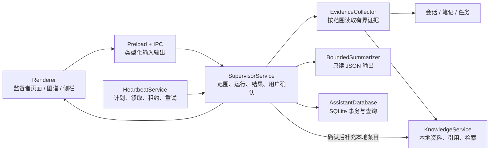
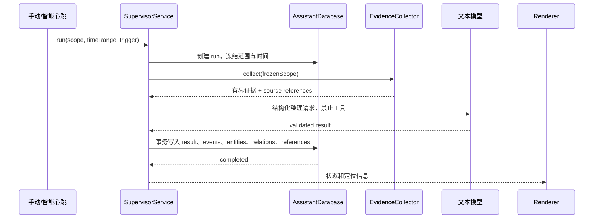
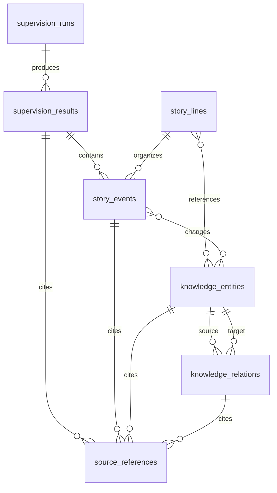

# 监督者技术设计

## 文档信息

| 项目 | 内容 |
| --- | --- |
| 状态 | 已接入自动增量、无变化状态、结果定位、目标过滤及同 scope 候选身份复用；完整历史回放和取消语义仍未完成 |
| 日期 | 2026-09-20 |
| 产品设计 | [监督者应用产品设计](./supervisor-prd.md) |
| 行为规则 | [监督者逻辑设计](./logic-design.md) |
| 界面设计 | [监督者 UI 设计](./ui-design.md) |
| 实施进度 | 共享契约、`SupervisorService`、SQLite schema 46、Preload IPC、定时投影、工作回顾、活动、结果图谱、来源读取、实体/关系状态操作、会话继续讨论、知识库预览写入和目标侧栏已接入 |

本文回答如何在现有 GoodBuddy 桌面端中实现监督者。它不改变产品范围，也不把模拟 Demo 当作生产数据模型。

当前实现边界：`src/main/assistant/supervisor-service.ts` 接收冻结的范围和时间区间，通过现有 AssistantDatabase 取得有界会话、任务、消息已有知识引用和已确认记忆，调用 ask Runtime 的结构化摘要器，校验来源引用与实体关系后在 SQLite 事务中保存。消息引用中的本地 library/document/chunk 和外部 locator 元数据写入监督来源；source-context 对本地引用调用现有 `KnowledgeService` 解析。记忆使用独立的 `memory` 来源类型，外部引用不触发远端全库检索。

模型实体 `id` 只在单次输出内有效。Main 从同一 scope 的故事线提供最多 100 个未撤销实体候选，模型可用独立的 `persistedId` 引用其中一个 UUID。服务校验候选集成员和重复映射，保存事务再次按实体主键校验故事线归属及撤销状态。没有 `persistedId` 时分配新 UUID，不按名称或裸模型 ID 合并。来源仍按每次结果分配 UUID，保留原始 `source_id` 和 locator。

schema 42 为实体、实体变化和关系增加 `source_reference_ids_json`，保存映射后的来源 ID。升级只补列，旧记录、ID、确认状态及 locator 保留；此前未保存的引用使用空数组，已被覆盖或忽略的历史内容无法据此恢复。

schema 43 在结果上增加 `graph_snapshot_json`，保存当次实体名称、说明、确认状态、关系理由及本次来源引用。后续 run 只更新 `automatic` 的当前实体与关系，已确认、修订或移除状态受保护。历史结果读取自身内容；人工操作带 `resultId` 时先校验成员归属，在事务内更新当前对象及所选结果，其他结果不变。移除关系记录 `revoked`，防止后续相同端点和类型的自动关系恢复它。

升级从现有事件实体关联、实体变化和来源引用恢复结果成员，不猜测名称匹配；旧数据缺失的归属或已经覆盖的内容无法还原，原对象仍保留。新结果即使实体没有事件或来源，也会保存完整成员。结果内容与运行、事件、来源在同一事务提交。

`overview({ target? })` 返回稳定的 `id`、`storyLineId` 及来源 ID。指定 Conversation/Task 时，Main 读取目标实际项目，查询同时要求目标来源匹配、结果 scope 为 global 或包含该项目；LIMIT 在过滤之后。卡片展示结果真实范围，global 结果不会伪装成单会话摘要。`graph({ resultId, storyLineId? })` 校验二者归属，只返回该结果的事件、对象和来源；显式 ID 无效时不回退到最新结果。继续讨论按结果主键读取，并验证来源属于该结果。

工作回顾保存所选结果，切换或刷新使用请求序号忽略迟到图谱。侧栏按目标重建卡片，清空来源和预览，并忽略旧请求；工作栏 tasks 实例的 `targetRef` 可保存 conversation/task 固定目标，取消固定后恢复跟随当前选择。该绑定只控制监督卡片，不改变任务列表的项目范围。继续讨论预览显示实际目标名称和 ID，发送回调显式携带该会话 ID，由 Main 使用该会话的 Runtime 与项目。

侧栏通过 `onOpenSupervisionGraph(resultId)` 交给 App 导航；App 遵守现有离页检查，向 HeartbeatCenter / SupervisorWorkspace 传递类型化 `graphNavigation`，复用 `heartbeat` 路由及 keepalive 页面。每次点击创建新的导航请求，打开 graph 页签并更新历史选择共用的 resultId。overview 未包含该 ID 时仍直接请求其 graph；旧 overview、graph、来源和操作响应通过同一请求序号失效，不覆盖新结果。没有新增 window 事件、页面或持久化字段。

继续讨论入队时，无附件请求省略 `serializedContexts`；请求未指定 Runtime 时使用会话保存的选择。知识库预览与提交均检查目标库存在且为本地可写库，更新实体还检查其实际所属库。侧栏确认框展示 Main 返回的实体字段、目标库和来源正文，取消或写入失败后可以重新预览。

手动监督 collector 将 UI 请求的 `timeRange` 原样传入 `buildHeartbeatInput` 的可选明确区间参数，查询时归一化为 UTC。消息按 `from <= created_at <= to` 在 LIMIT 前过滤，会话也在 LIMIT 前检查存在区间内消息；所选项目复用现有存在且 active 的校验。任务在创建时间或完成时间落入闭区间时收集，证据时间优先使用区间内完成时间，否则使用创建时间；任务状态为当前状态。手动心跳保留原有收集行为；自动运行使用下节的增量查询。

已确认记忆作为当前背景收集，不受事件时间区间筛选；`occurredAt` 使用数据库 `updated_at`，locator 保存真实创建、更新时间及 `current-background` 标识。模型指令禁止将当前记忆内容推断成历史时点的内容或区间事件。记忆没有历史内容快照；本次修复不增加历史还原能力，也不追溯修正已有监督结果。既有会话、消息、任务及总证据预算继续生效，严格时间筛选不代表区间内所有记录都会进入摘要。

## 自动增量收集

对应 FR-S4、FR-S10 和 US-S27，行为定义见[自动增量与手动重看](./logic-design.md#自动增量与手动重看)。schema 46 在现有数据库增加 `review_checkpoints`，主键为阶段、规范化 scope 和来源标识，保存版本指纹、已处理位置和来源长度。来源标识区分消息 ID、任务 ID 和消息内知识引用位置，不使用消息时间戳作为身份。

消息正文写入时由 SQLite trigger 更新轻量 `review_revision`；范围、标题、角色和时间共同参与版本指纹。任务标题、状态、创建和完成时间，以及知识引用内容或定位变化分别使对应来源待处理。工具执行元数据更新不会把未修改的消息正文再次标为新增。删除来源时清理其进度。原始消息不复制到进度表；自动查询先排除已处理版本，再读取待处理片段，不重新载入每个会话的历史正文。

查询按来源时间和 ID 排序，在过滤之后取最多 100 个来源，每个来源每轮读取后续最多 2,000 个 Unicode 字符。自动心跳新证据正文预算为 12,000 个 JS 字符，监督为 44,000；最多四条各 500 字符的已确认记忆和最近 2,000 字符摘要提供背景，监督仍执行 100 条及 48,000 字符证据上限。自动路径取消“只取最新 20 个会话、每会话最新 20 条”的预筛选，预算遗漏和长正文剩余部分留到后续检查。已超出下一次滚动窗口的来源不会自动扩大范围读取。

只有实际送入模型、通过结果校验且成功落库的完整片段推进位置。心跳报告及其进度、监督结果及其进度分别在各自 SQLite 事务提交。监督服务串行执行，后续自动请求在前次保存后重新收集。报告成功而监督失败时，下一次自动检查跳过已成功的报告输入，但重试监督输入；无变化不创建报告、来源或图谱事件。

已有同 scope 故事线的 scope 表示和实体 ID 保留；比较项目集合时忽略排序。模型接收最近摘要和同 scope 最多 100 个未撤销实体的 ID、名称、说明，显式返回 `persistedId` 才复用。不同范围不合并，已有重复实体不自动修复。知识引用继续以独立来源保存 locator；当前记忆和旧摘要不作为新事件。

迁移在事务中扩展心跳计划及运行表的状态 CHECK，保留列、索引、ID、计划、报告与引用；消息版本列使用默认值，无需遍历或重写旧正文。进度初始为空，首次自动运行从配置窗口开始。报告保留期限覆盖 `no_change` 运行，但不删除来源进度；删除报告不触发重新消费。

## 活动读取与执行持久化

对应 FR-S10、US-S26。schema 45 在既有 `supervision_runs` 增加可空 `heartbeat_run_id` 和唯一索引，在 `heartbeat_runs` 增加执行范围、下游投影状态、错误及结束时间字段。迁移保留原记录，不补造旧关联。监督服务通过 store 的 start/fail 接线记录执行，保存结果事务更新同一 run；不增加调度器。心跳在执行前记录冻结范围和投影进度，报告事务仍保持原有含义，下游失败单独保存。手动心跳在生产路径使用实际结束时间，活动等待下游结束后才显示整次执行的结束时间。

`supervision:activity` 沿用可信 sender 与 Zod 输入校验，接受 `limit`（1 至 100，默认 50）和 `offset`（0 至 100000）。应用未启用时返回空列表且不访问活动表。SQL 合并心跳及未关联的监督记录，关联查询使用运行 ID；返回状态、阶段、范围、时间、错误、摘要和 resultId，不调用模型。保留规则和历史缺失见[活动记录](./logic-design.md#活动记录)。

Preload 暴露类型化 `supervision.activity()`。`overview({ resultId })` 支持按 ID 读取历史回顾，供活动跳转使用。Renderer 只在活动页签和 heartbeat 路由同时激活时串行定时读取，每次有界分页；effect 清理撤销定时器并使旧响应失效。App 关闭应用时卸载页面；读取没有执行副作用。该改动位于桌面 Main/Renderer，未修改 Agent 或远程 Runtime 协议。

## 1. 总体方案

监督者作为 Main 进程中的一个领域服务，复用现有智能心跳的计划、运行领取、租约、重试和有界模型调用。图谱是监督者整理结果的查询视图，知识库继续拥有资料正文、索引和检索。

职责边界如下：

| 模块 | 负责 | 不负责 |
| --- | --- | --- |
| `HeartbeatService` | 计划、到期运行、租约、重试、已有报告兼容 | 图谱实体合并、用户确认、知识库写入编排 |
| `SupervisorService` | 触发统一、证据收集、整理结果、图谱查询和修订 | 自己实现调度器、复制来源正文 |
| `EvidenceCollector` | 按冻结范围读取会话、笔记、任务、知识库引用 | 越过范围读取全部数据、调用工具 |
| `SupervisorSummarizer` | 以有界输入调用文本模型并解析结构化输出 | 执行工具、直接修改知识库 |
| `AssistantDatabase` | 事务、外键、分页、状态和来源定位持久化 | 生成模型内容 |
| `KnowledgeService` | 资料和本地知识条目的维护、检索及引用 | 管理监督者事件和关系 |
| Renderer | 展示和发起用户操作 | 访问 SQLite、决定权限或拼接 SQL |

## 2. 运行路径

应用启停遵守[逻辑规则](./logic-design.md#应用启停与执行)。`ApplicationSettingsStore` 对新设置及缺失的 `heartbeatEnabled` 使用 `false`，保留显式布尔值。Main 在心跳 tick 调用 `processDue()` 前、`heartbeatsRunNow` 与 `supervisionRun` IPC 入口、心跳完成后的监督回顾回调中读取已保存设置，只有值为 `true` 才继续。此检查不取消已领取运行，也不改变普通任务调度链路。Renderer 由 App 将同一启用状态传入 `RightAssistantSidebar`，控制监督面板挂载。

设置默认选中既有 `plans` 面板，直接渲染 `HeartbeatSettings`，沿用 App → Preload → Main 的计划 CRUD 接线。`heartbeatRecurrenceSchema` 与 `computeNextHeartbeatRun` 仅支持 daily/weekly；本轮不增加分钟间隔合同或调度分支。编辑草稿保存已有 `timezone` 和 `enabled`，新建仅在显式提交时使用本机时区创建启用计划。UI 命名统一为自动监督，内部 ID、翻译键、数据库及 IPC 名称保留。

手动回顾和心跳回顾必须经过同一个 `SupervisorService.run()`，只在触发来源上区分。这样可以保证两者使用相同的范围校验、输入预算、输出契约、结果状态和来源处理。

运行状态与内容确认状态分开保存：

- 当前监督运行状态：`running`、`completed`、`failed`、`no_change`。心跳及合并活动的映射见[活动记录](./logic-design.md#活动记录)。
- 内容状态：来源事实、自动归纳、待核对、用户确认、用户修订、已移除关系。
- 运行成功只表示模型结果已按契约保存，不表示所有实体和关系已经被用户确认。
- 失败保留上次成功结果；取消和部分完成仍未接入生产状态。

## 3. 数据模型

首版使用现有 `AssistantDatabase` 和同一 SQLite 数据库。新增表保持领域对象独立，但不复制会话、笔记或知识库正文。

建议的最小持久化对象：

| 对象 | 关键字段 | 说明 |
| --- | --- | --- |
| `supervision_runs` | `id`, `trigger`, `scope_json`, `time_range_json`, `status`, `error`, `started_at`, `completed_at` | 一次手动或心跳整理；保存冻结范围，不从当前配置回推历史 |
| `supervision_results` | `id`, `run_id`, `summary`, `change_digest`, `coverage_json`, `graph_snapshot_json` | 工作回顾、监督反馈和图谱共同读取的结果版本 |
| `story_lines` | `id`, `scope_json`, `title`, `created_at`, `updated_at` | 用户选择的工作故事线，不等同于 Project |
| `story_events` | `id`, `story_line_id`, `result_id`, `occurred_at`, `title`, `description`, `event_type`, `confidence` | 时间轴上的事件；同日聚合只在查询或 UI 层处理 |
| `knowledge_entities` | `id`, `canonical_label`, `description`, `state`, `confirmation_state`, `updated_at` | 可被多条故事线引用的持续认识，不与知识库文档一一对应 |
| `entity_changes` | `event_id`, `entity_id`, `change_type`, `description`, `confirmation_state` | 表达提出、补充、验证和修订，避免覆盖实体正文 |
| `knowledge_relations` | `id`, `from_entity_id`, `to_entity_id`, `relation_type`, `reason`, `confirmation_state` | 关系独立拥有状态和来源；移除关系不删除来源 |
| `source_references` | `id`, `owner_type`, `owner_id`, `source_type`, `source_id`, `locator_json`, `availability` | 只保存来源标识和有界定位，不复制正文 |

外键和索引要求：

- 所有监督者对象使用 UUID；实体、来源和关系通过稳定 ID 关联，不能只按名称合并。
- `supervision_runs` 按 `created_at`、`scope` 查询；事件按 `story_line_id, occurred_at` 查询。
- 关系对 `(from_entity_id, to_entity_id, relation_type)` 建唯一约束，允许同一实体对存在不同关系类型。
- 删除故事线只删除其组织关系，不删除共享实体、来源或知识库资料；删除知识库资料后来源标为不可用。
- 整理结果、实体变化、关系变化和来源引用在同一 SQLite 事务中提交，提交失败全部回滚。
- 只保存整理结果自身的对象内容与有界来源，不建立原会话、记忆或知识库的完整历史快照和独立向量索引。

模型输出使用版本化共享契约，至少包含 `events`、`entities`、`entityChanges`、`relations`、`summary`、`openItems` 和每项的 `sourceReferenceIds`。Main 必须做数量、字符、枚举、ID 所属范围和引用存在性校验，未知字段拒绝或按契约版本处理，不能直接把模型 JSON 写入数据库。

## 4. Main、IPC 与 Renderer

新增能力沿用现有边界：Renderer 只传业务输入，Main 重新校验项目、故事线、时间范围、来源和权限。

建议的 IPC 分组：

| 通道 | 用途 |
| --- | --- |
| `supervision:overview` | 工作回顾、运行状态、未解决事项和最近结果 |
| `supervision:run` | 手动开始一次整理，完成后返回包含 runId 的结果 |
| `supervision:activity` | 有界读取真实执行和阶段状态 |
| `supervision:graph` | 按故事线、时间区间和回放时刻分页读取图谱 |
| `supervision:object` | 读取事件、实体、关系及来源详情 |
| `supervision:confirm` | 确认、修订或移除自动关系和实体变化 |
| `supervision:continue-context` | 生成继续讨论前的上下文预览 |
| `supervision:knowledge-preview` | 预览新建或补充本地知识条目 |
| `supervision:knowledge-commit` | 用户确认后调用知识库服务写入 |

IPC 返回图谱查询结果时使用分页和有界字段；详情中的来源正文复用现有会话、笔记和知识库读取路径。不要把完整图谱一次性发送给 Renderer，也不要把模型原始输出暴露为可执行内容。

侧栏反馈通过已有应用状态刷新机制读取结果。首版可以在手动运行完成后主动刷新，心跳完成后发布一个不含私人正文的变更通知，Renderer 再按权限读取摘要；不新增系统通知正文通道。

## 5. 安全与一致性

- 监督者模型调用固定为 `ask` 语义，输入来自 `EvidenceCollector` 的有界快照，工具授权始终拒绝。
- `Global`、Project、多项目和固定 Conversation/Task/Experiment 目标在 Main 冻结；模型不能生成或改变范围。
- 每个来源引用必须属于本次冻结范围，跨范围引用、伪造项目 ID 和不存在的来源 ID 直接使结果失败。
- 心跳运行沿用现有 `heartbeat_runs` 的领取、租约和重试机制；新增监督运行按心跳运行 ID 关联，活动据此合并阶段。没有新增取消协议。
- 同一配置同时触发手动和定时运行时，沿用现有幂等键和运行领取规则；已完成结果不能重复写入。
- 用户确认或修订后的实体、关系不被后续整理静默覆盖；新证据以补充或冲突待核对状态写入。
- 外部知识库只读。图谱可以引用保存到本地的外部片段和定位信息，不调用远端写入、不承诺打开远端原文。
- 来源正文仍由原应用拥有。监督者删除关系、故事线或运行记录时不得删除会话、笔记、任务或知识库资料。

## 6. 实施顺序

### 阶段 A：先把现有心跳变成统一运行入口

- 抽出 `HeartbeatSummarizer` 的有界输入和结构化输出校验，使 `SupervisorService` 可以复用。
- 增加手动运行的统一服务入口，但先只生成现有回顾结果，不改变心跳页面行为。
- 为运行状态、范围冻结、失败保留旧结果补充 Main 单元测试。

### 阶段 B：接入证据引用和阶段回顾

- 实现 `EvidenceCollector`，接入会话、任务、消息已有知识引用和记忆；魔法笔记仍未接入。
- 建立 `supervision_runs`、`supervision_results` 和 `supervision_sources`，保存来源 locator，并通过 `KnowledgeService` 解析本地文档/分块。
- 在现有智能心跳页面增加监督者工作回顾入口；不先改应用名称和导航 ID。

### 阶段 C：实现最小故事线图谱

- 建立事件、实体、实体变化和关系表及查询服务。
- 先完成平铺环绕时间轴、节点详情、来源展开、回放和列表模式；圆形视图继续作为后续布局。
- 同一实体通过稳定 ID 连接多个事件，禁止按每次事件复制实体。
- 用真实整理结果替换 Demo 的模拟数据，并保留 Demo 作为视觉回归 fixture。

### 阶段 D：接入用户确认和知识库双向定位

- 增加关系确认、修订、撤销和实体拆分的最小交互。
- 从图谱返回本地会话资料及引用位置；知识库文档定位依赖来源中存在文档/分块元数据。
- 新建或补充本地条目必须经过预览和确认；外部知识库保持只读。

### 阶段 E：侧栏反馈与增量整理

- 将结果摘要投影到现有右侧助手栏，并沿用当前会话生命周期。
- 心跳只负责触发，监督者根据新证据决定有无变化和是否反馈。
- 在运行去重、用户修订保护和来源失效提示稳定后，再评估更复杂的跨目标固定策略、事件唤醒和自动阶段识别。

## 7. 验证策略

首版每层验证一条可追踪链路：

1. `EvidenceCollector` 测试范围裁剪、字符预算、来源定位和不可用来源。
2. `SupervisorService` 测试模型输出解析、引用完整性、重复运行、取消、失败和部分结果。
3. `AssistantDatabase` 测试迁移、事务回滚、外键、分页、关系移除不删来源。
4. IPC 测试不可信输入、越权 Project/Source ID、确认状态和知识库写入前置预览。
5. Renderer 测试从反馈进入图谱、点击实体高亮多个时间点、回放不显示未来结果，以及窄屏列表访问。
6. 使用一组固定脱敏 fixture 验证“监督反馈 → 实体 → 多个事件 → 来源 → 继续讨论”的完整路径。

首个生产验收不要求模型自动发现所有关系。必须先证明来源可追溯、失败可解释、用户修订不会丢失，以及图谱与工作回顾读取同一结果。

## 8. 暂不实现的内容

- 独立的图数据库、向量图谱或新的知识库正文存储。
- 让监督者拥有通用 Agent 工具执行能力。
- 自动把所有聊天消息变成事件或节点。
- 无依据的实体自动合并、旧观点自动失效和静默覆盖用户确认。
- 应用市场建设作为监督者开发前置依赖。
- 在没有增量和去重证据前实现事件触发、自动阶段识别和全量后台重算。

## 当前剩余差距

- 实体与关系 revoke 保存状态；界面没有 undo 或恢复入口。
- 跨 run identity 依赖同 scope 候选 UUID 的显式引用，不自动合并历史重复实体；模型漏选候选时会创建新身份。
- 结果图谱使用真实事件实体连线，侧栏已按固定目标过滤并支持结果直达图谱；逐事件状态回放和 Experiment 尚未实现。
- 用户取消及其旧结果保留尚未贯通监督运行的生产状态链路；自动 `no_change` 见[自动增量收集](#自动增量收集)。
- 监督知识实体与知识库正文条目仍是不同对象，知识正文只能通过现有条目定位和预览接口处理。
