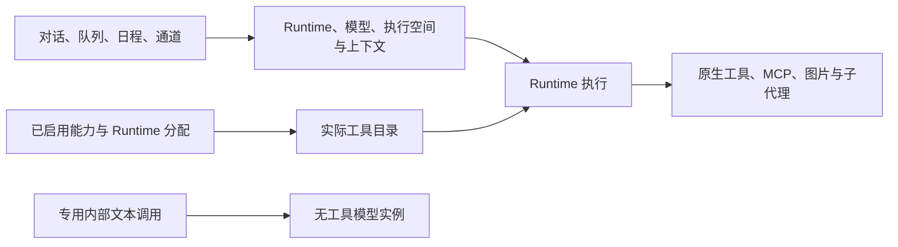

# 技术设计

状态：主要源码改造已落地，完整验证待完成。规则见[PRD](./prd.md)与[执行规则](./logic-design.md)，调研基线见[源码调研](./source-audit.md)，字段级转换见[数据迁移](./data-migration.md)，实际证据见[进度](./progress.md)。

## 结构调整

正常调用保留现有 Renderer → IPC → Runtime → 工具执行链路，删除各层携带的产品工作模式。无需新增权限服务、策略框架或持久化状态。

图中表示当前源码结构。模型和 Runtime 的真实能力限制、能力启用与分配、工具业务校验仍在原有实现中处理；产品 `toolApproval` 策略与一般工具审批等待已移除。

## 合同与调用边界

删除 `WorkMode`、`InteractiveWorkMode`、生产使用的 `LegacyWorkMode`、`normalizeInteractiveWorkMode` 及请求/结果中的模式字段。迁移模块可以识别历史键和值，但不得让兼容类型继续进入新执行请求。

同步修改 `assistant-contracts`、`contracts`、`runtime`、`image-generation-contracts`、`channel-contracts`、`remote-project-candidate-contracts`、`remote-runtime-launch-contracts` 和 `remote-agent-contracts`。原生清单的 `ask/execute` 属性以及能力说明中的 `availableIn` 模式数组一并删除。

IPC、preload 类型、Renderer 事件、任务投影、队列输入、子代理活动和恢复入口必须使用同一无模式形状。不能依赖 Zod 自动剥离字段代替实际持久化清理；严格 schema 的切换顺序须配合升级。

按 L-5 和 US-17 删除 `toolApproval` 的共享合同、默认值、设置读写、IPC 更新字段和各来源拒绝分支。移除一般工具审批的 Broker 等待、事件、回应入口与界面引用；保留原生权限协议的合法回应、结构化提问、取消和超时。不得把旧策略改成常驻的自动允许字段。

`stripWorkModeInstruction` 已删除，新请求不注入模式提示词。历史回放保留用户正文，不以任意正文以 `Work mode:` 开头为依据删除内容；既有不可信历史信封仍按完整格式解析。

## Runtime 实施清单

| 模块 | 必做调整 | 需保留的机制 |
| --- | --- | --- |
| Controller / Model | 删除 Ask deny authorizer、工具循环模式条件、目录和调用双重检查；删除 `rg` 的 Ask 参数解析 | 纯文本实例、工具注册身份、输出分页、取消、进程清理、工作区 API 语义 |
| OpenCode | 删除模式权限模板、Ask tool override、MCP/图片注册模式条件和 Ask 回应分支 | 运行时会话隔离、临时 MCP 生命周期、问题与权限协议的合法回应 |
| Continue | 删除产品模式参数、只读名单、模式选择 argv 和 MCP 拒绝分支；核对原生配置合并 | 与固定上游版本有关的其他补丁、Windows 处理、结构化问题、工具配置 |
| Harness | 删除 host 的 trusted Ask 定义、控制面的 Ask 工具钩子、prepare 模式及 ACP 模式宣告 | 工具实际注册、插件、请求归属、工具事件与输出回传 |
| 原生客户端 | 删除模式参与的启动身份、Continue 注入限制、OpenCode/DS Web 模式插件 | 用户历史目录、资源回收、独立上游配置和必要启动适配 |
| 内置 MCP / 图片 | 调整权限发放入口；移除图片服务及绑定的模式字段、回调、拒绝和描述隐藏 | 启用和分配、资源范围、模型配置、计划有效性、图片引用与保存语义 |
| 子代理与内部任务 | 删除继承及 Ask-only 智能路由条件；内部分析使用无工具实例 | 已有路由开关、能力上下文、专家/团队、摘要和监督者无工具性质 |
| 调度 / 通道 / 委派 | 删除模式、`toolApproval` 策略、一般工具审批等待及委派固定拒绝，不再识别模式前缀 | 时间计划、来源身份、队列顺序、业务许可和结果投递 |

原生工具没有通用逐工具开关，不能把新增设置系统作为移除前提。Continue `chat/agent`、OpenCode 原生 agent 类型、上游权限 `ask` 和文件权限 `mode` 按各自含义保留；仅删除它们与 GoodBuddy 工作模式的耦合。

## 远程协议与升级

Agent wire 保持 2.0，`runtime/acp` capability 已从 5 升至 6；prepare、acceptance 和 launch 不再含 `workMode`，使用既有精确版本协商拒绝旧端。本地 Harness 控制扩展由 1 升至 2，Utility 启动控制协议仍为 3，两者不混用。

Desktop、Agent、CLI、runtime profile、model bridge 路由、Continue helper、OpenCode 子会话插件必须同批更新。删除 `--work-mode`、模式相关进程冲突与路由字段，并重建受影响的受管包。当前源码版本与包锁版本不可混用作为验收证据。

旧 Agent 必须在提交新任务前被识别并提示更新，不能失败后补 `execute` 再投递。对于旧版已接受任务，保持 operation ID、prepare/start digest、事件序号和 ACK；使用已有状态查询、恢复与升级流程，不自动重发请求。若新合同不能恢复某种旧会话，必须报告明确状态，并在发布前给出已验证的处理路径。

远程 `semantic-prompt` 存储没有完整 preparation 对象，无法根据删字段后的请求重建旧摘要。字段迁移与摘要比较的关系见数据迁移。当前通用远程 MCP 转发缺口独立记录，不将模式删除描述为新增远程支持。

外部 `/goodbuddy/tasks/next` 委派入口接受无模式形状，也接受并丢弃旧 `ask/plan/execute` 字段；向内部只传无模式对象。新输出不发送模式，外部服务兼容性仍需验收。这个兼容入口不决定工具权限。

## 历史升级执行顺序

1. 先修改新写入形状与读取投影，建立旧字段转换测试。
2. 在现有启动 Worker 中执行版本升级；业务连接、恢复、队列和日程不得先读取未转换记录。
3. 保留已发布迁移链，schema 60 追加字段移除迁移。Runtime 设置 22 定向删除顶层 `toolApproval`，两类升级各自执行。
4. 清理 localStorage 导入、旧队列解析和远程事件归一化，避免升级后写回旧字段。
5. 新库和真实旧库副本走同一产品启动路径验收；不默认执行全库 `VACUUM`。

迁移不能通过重新序列化为窄 schema 丢弃其他元数据；不新增迁移日志框架或持久化恢复凭证。

## 实施阶段

| 阶段 | 内容 | 进入下一阶段的证据 |
| --- | --- | --- |
| P1 | 合同、状态、数据库与 Runtime 设置迁移 | 新写入无模式及 `toolApproval`，旧数据转换可重复，字段外内容与身份不变 |
| P2 | Controller、各本地 Runtime、工具与内部任务 | 生产调用链不依赖模式；正常工具任务与内部无工具任务均通过 |
| P3 | 原生客户端、子代理、队列、日程、通道和委派 | 启动配置及各来源实际可用，取消/恢复不回退旧逻辑 |
| P4 | Desktop-Agent 协议、辅助程序与受管包 | 兼容性协商及真实 Host 的当前源码路径通过 |
| P5 | UI、文案、当前规范及发布说明 | 无模式和安全分类，通用设置可确认或取消清除数据，中英文界面与迁移验收完成 |

阶段可在开发中交叉推进，最终必须一起交付；不能发布仅删除界面而后端仍依赖模式的中间状态。

## 验证矩阵

| 层次 | 验证内容 | 证据形式 |
| --- | --- | --- |
| 静态清点 | 字段、模式分支、默认值、CLI、生成插件、提示词与 i18n | 对每个剩余搜索命中说明其为历史迁移或无关语义 |
| 存储 | 新库、schema 59、较早已发布库、重复启动、失败与恢复、远程重放 | 产品 Worker 升级、内容比较、完整性检查与计时 |
| 设置 | Runtime 设置 21 及更早支持版本、全部旧策略值、保存与重启 | 新版本落盘无 `toolApproval`，其他设置及加密凭据字节保留；历史必填字段不新增缺省策略 |
| 工具 | 原生各工具组、启用/关闭 MCP、图片生成保存、业务错误 | 真实入口调用结果；关闭服务不能被伪造调用绕过 |
| Runtime | Model、OC、CN、DSH、各原生客户端及其子任务 | 聚焦测试加生产路径验证，包含动态插件工具 |
| 请求来源 | 对话、恢复队列、定时、通道、委派、内部分析 | 无旧策略拒绝或一般审批等待，任务身份与结果一致，内部分析没有工具 |
| 远程 | 兼容/不兼容版本、OpenCode/Continue、断开恢复、停止与重启 | 共享 Linux x64 Host 上的当前源码或开发包验证 |
| UI | 各删除面、键盘、窄窗口、浅深主题和中英文 | 真实 Electron 验收及组件回归 |

完成代码改造后运行 `npm test`、`npm run typecheck`、`npm run lint`。构建、真实模型和 Agent 验证遵循仓库开发规则；记录实际请求数，不把已有单测或配置检查写成端到端通过。图片提供商调用与纯文本模型验证分开记录。

## 文档同步清单

根运行时约定、站点中英文 HTML 及下列 Markdown 现行规范已按无模式源码更新。日期明确的历史记录保留原状；尚未实现的功能仍标为规划，完整测试与发布包验证不因文档同步而视为通过。

| 文档范围 | 更新内容 |
| --- | --- |
| 根 `AGENTS.md`、`UI-DESIGN.md` | 删除 Ask 只读、Execute 授权与选择器规范；删除安全分类，将清除数据放入通用设置；保留 OS、生命周期和发布规则 |
| 根 README、FEATURES 中英文、`BUILD.md`、站点 | 能力介绍、启动与升级说明 |
| assistant-workbar、direct-model-agent、deepseek-harness、remote-host | 执行、原生客户端、合同、权限协议和真实验证 |
| task-and-job、wechat-channel、telegram-channel | 任务字段、日程继承、旧命令和未来通道需求 |
| conversation-media-generation、computer-control、obsidian、magic-notes、conversation-supervision | 模式依赖、业务范围与内部无工具任务 |
| device-sharing 与跨功能架构 | 已有委派合同；不扩大设备共享的当前实现范围 |
| local-tool-environment、application-tool-navigation、知识与文档类功能 | 引用旧模式的设置说明与功能条件 |
| desktop-pet、office-document-editing、full-duplex-voice、路线图 | 尚未实施方案中的旧模式依赖 |
| 开发验证脚本与发布手册 | 模式参数、旧验收场景和 Agent 兼容步骤 |

旧发布说明、日期明确的测试记录和审查报告保留当时事实，通过新版说明建立替代关系，不伪造过去的验证结果。
