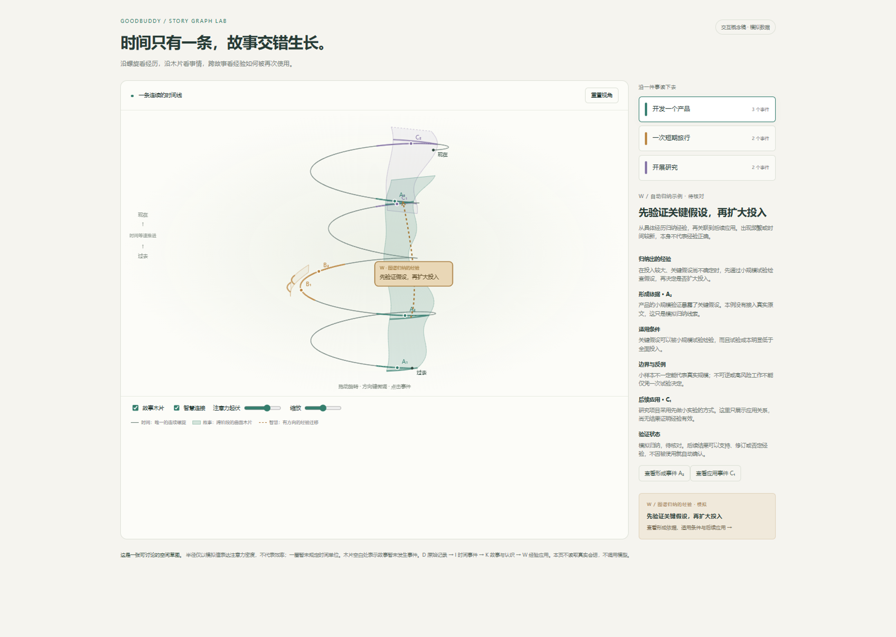

# GoodBuddy 更新：故事图谱、Obsidian接入、Runtime原生终端

> **编辑标注说明（对外发布前删除）：** 本稿汇总桌面版 0.13.8 至 0.15.13，以及其后截至 `384683e8` 的已提交变化，更新于 2026-10-08。所述功能与修复均已开发完成并提交，验证及发布归属另行标注；原故事线概念图仅作示意，待换为生产界面截图。“待补图”表示缺少可发布素材，“待替换”表示发布信息未核验，“待核对”表示发布前需要确认的行为。本文是宣传草稿，尚未对外发布。

GoodBuddy 这一轮更新围绕工作记录的整理与使用展开：监督者把分散的事件归入持续发展的故事，从中整理带有来源和适用条件的经验，供人和助手在后续工作中查阅。笔记连接支持保存聊天正文、返回原会话，以及在聊天中读写本机 Obsidian 笔记。本地项目还可以从输入区打开 Continue、OpenCode 原生终端或 DS Web 客户端，沿用当前项目与模型配置。

本文接续上一份画布笔记与文档处理更新稿，覆盖 0.13.8 起的实际增量。这次还加入了智能心跳、笔记标签、会话图片保存、Telegram 私聊和工作区文件导入。项目与会话集中到同一个菜单，提问和执行任务也无需再切换工作模式。远程统一执行、文件导入和后续 Runtime 修复建议配套 Desktop 0.15.13 和 Agent 0.15.6，请先升级桌面端，再更新 Host 环境。

> **【待替换 R01｜版本与体验入口】** 当前版本资料为 Desktop `0.15.13`、Agent `0.15.6`；本轮检查 `e50ca6d1..384683e8`，共 22 个提交。`0.15.12`、`0.15.13` 的发布说明已覆盖其中的主要功能，后续测试和发布维护提交不单独作为新功能。对外发布前仍需核验公开安装包、发布日期、下载地址和完整更新日志链接，并在此补入。桌面 0.13.14 的发布失败后由 0.13.15 承接。

**升级前，请先关闭应用并备份完整用户数据。** 数据库、设置和相邻的 `notes/` 目录需要成套保留；如有 WAL 文件，也应一并备份。当前核查提交的助理数据库格式为 62，0.15.13 之前的客户端不能直接打开新版数据库，回退需要升级前的备份。大库首次转换可能需要等待。高频本地保存调整了磁盘同步策略，断电时可能丢失最近尚未同步的写入。

## 新增功能

### 监督者：从工作记录中整理进展，查看每条结论的依据

项目讨论持续一段时间后，可以打开“监督者”的“工作回顾”，选择全局或一个项目，再选择最近 1 天、7 天、30 天、自定义最近天数或起止日期。指定日期按本地时区包含结束日全天，结束日为今天时截至发起回顾的时刻。回顾会整理工作总结、本次变化和未解决事项，并按故事列出这段时间的推进、新出现与结束的事项，以及形成或用上的经验。点击故事或经验，可以进入图谱查看依据；历史结果保留各自的范围和生成时间，方便回看。

监督者默认关闭，在应用中心启用后即可手动回顾，无需先建立自动计划。当前分析来源包括范围内的用户与助手消息、任务标题与当前状态，以及消息中已有的知识引用片段。它不会自动遍历全部笔记、整个知识库或附件原件。

> **【待补图 01｜必补｜工作回顾结果】** 在隔离演示项目中通过正常聊天和任务操作形成公开、虚构的工作记录，运行一次真实回顾。截图同时展示范围、时间和实际生成的总结、未解决事项；不能用预置答案冒充模型结果。计划文件：`assets/01-work-review.png`。
>
> 建议图注：按项目回顾近期讨论与任务，查看进展和仍待处理的问题。

回顾中的事件、实体与关系可以在“故事线图谱”中查看。选中一个对象，就能检查它的说明、关联和保存的来源正文，再判断模型的归纳是否准确。实体支持确认、改名或撤销，关系可以确认或移除。

这适合检查“某个结论来自哪段讨论”“一个事项与哪些事件有关”。图谱提供平铺和时间螺旋两种浏览方式，时间螺旋按事件时间排列；平铺视图中的节点间距不表示实际时长。历史回顾中的故事分组使用当前保存的故事结构，尚不提供任意时刻的完整状态还原。

> **【待补图 02｜必补｜图谱与来源】** 使用图 01 同一份真实回顾结果，选中事件或实体，展示对应的来源正文。画面应能辨认对象与依据的关联；不使用设计原型代替生产结果。计划文件：`assets/02-story-sources.png`。
>
> 建议图注：从回顾图谱查看关联对象，并打开保存的讨论依据。

### 故事与时间螺旋：追踪一件事如何持续发展

一项功能往往经过多次讨论、试验和修订。回顾后，相关事件可以归入同一个故事，按项目、功能和子线索逐层浏览；后续有新进展时继续积累，不必每次从零查找。用户可以调整名称、合并重复故事、移动归错的事件，也能撤销调整；移除故事会保留其中的事件。

时间螺旋把这些故事放到连续时间上，便于查看不同工作如何交错推进。同一件事可以隔一段时间再继续，中间的停顿保留下来。螺旋高度对应时间，半径按所选回顾范围内的消息密度变化，不代表实际工时、效率或成果价值；消息按小时汇总，无法还原小时内的精细分布。

实际事件区间和事件点使用主故事的颜色，空白区间与未归属事件保持中性色。历史回顾中尚未归入故事的事件也会保留，可以在“未归属”分组查看；故事分组采用当前关系，不把它当作当时分类的完整还原。

视图支持斜俯视、侧视、俯视和自由视角，可以逐层进入项目、功能与子线索，选中故事或事件查看详情。当前层可显示部分经验及其跨故事应用连线，完整经验列表仍在“经验”页签中查阅。设备无法使用 3D 时，可以切回平铺视图。

*早期概念示意，使用示例数据；不是当前生产界面的截图，实际布局与操作以应用为准。*

> **【待补图 09｜必补｜故事与经验的生产视图】** 原图保留作概念参考。发布前用目标版本的真实回顾结果替换，展示同一故事的事件、经验形成依据与后续应用，并核对平铺和时间螺旋中的选择联动。计划文件：`assets/09-story-experience.png`。
>
> 建议图注：沿故事查看工作进展，从经验节点核对形成依据与后续应用记录。

### 从故事中整理经验，保留适用条件和依据

故事积累到一定规模，并出现新的决定、变化或里程碑后，监督者可以从事件摘要中归纳经验，保存适用条件、边界和形成依据。自动归纳的内容有明确标记，用户可以编辑、合并或删除，再回到原讨论核对。

后续回顾还可以记录某条经验在哪些事件中得到应用。应用记录会核对事件是否晚于最早形成事件的起始时间，并与至少一个形成事件涉及共同实体；这些记录仍是模型对历史的归纳，需要结合来源判断，不能据此断定经验已经产生效果。助手可以查阅这些经验，为后续工作提供参考。

### 助手可以查阅故事图谱，接着已有决定继续工作

继续一个项目时，可以请助手“查一下此前选了哪个方案，依据是什么”，或“找出这项决定后来的修订”。助手可搜索监督者已经保存的故事、经验、事件、实体、关系和回顾结果，读取相关上下文，再查看来源片段，作为后续讨论的依据。故事上下文带出相关事件，经验上下文带出形成和应用记录。

工具说明也会引导助手在继续旧工作、追问决定原因或遇到可能已有约定的任务时主动查阅，优先找故事与经验。是否调用仍由当前模型判断；普通闲聊和独立的通用问题不要求查询，也不会在每次对话中自动塞入整张图谱。

在应用中心启用监督者，并在 MCP 设置中保持 Story Graph 开启、分配给所用 Runtime 后即可使用。支持直连模型、DeepSeek Harness，以及本地和远程 OpenCode、Continue；本地 Continue、OpenCode 原生终端也可读取。

输入区的选项中可以为当前会话单独开关故事图谱访问。默认允许查询，但仍受监督者总开关和工具配置约束；开启不会自动运行回顾或注入上下文，关闭也不会删除图谱，或将这个会话排除在后续回顾之外。

查询默认使用当前项目，也可明确指定全局或项目集合。事件可从共享时间线中按项目查阅，回顾结果仍保留各自的范围。工具只读取已有记录，不会为一次查询重新运行回顾或修改图谱；助手根据结果生成回答仍使用当前模型。保存的来源片段可以分页读取，尚不支持任意时刻的完整历史状态重建。

### 智能心跳：按新增工作回顾，并提出可处理的建议

为项目设置每日或每周计划后，智能心跳会整理回顾窗口内新增、修改或尚待处理的记录，把变化保存到故事图谱。计划默认生成建议，也可以选择“仅更新记忆”；没有新来源时跳过事实提取，仍可补做尚未完成的故事与经验整理。没有待处理工作时，不调用模型。

建议围绕本次回顾发现的未决事项、分歧、修订和候选约定展开，并保留来源供核对。接受未决事项后，会创建一项暂停任务，方便先检查再开始；候选约定经确认后才进入长期记忆。建议生成失败可以单独重试，已经保存的图谱和回顾进度仍然保留。

心跳完成回顾后，还可以提示达到设定天数仍没有新进展的故事，或指出某条已有经验可能适用于当前故事。建议可以直接打开图谱；接受暂无进展建议会建立暂停任务，接受经验建议只标记已参考，不会据此写入经验应用记录。暂无进展默认按 14 天筛选；仅时间流逝到期、但本次回顾没有变化时，不会单独触发提醒。

计划需要应用保持运行，并按所选全局或项目范围处理。心跳不会在每条聊天消息后实时介入；有候选建议时会额外调用模型整理措辞，回顾本身也可能分批调用模型。

### 在任务中心跟踪当前会话或任务

右侧任务中心的项目概览下方新增监督反馈。选中任务时查看该任务的匹配结果，否则跟随当前会话；也可以固定目标，切换聊天后继续查看同一个事项。没有匹配回顾时会明确显示空状态。

监督反馈中的“继续讨论”可以直接使用，无需先打开来源。侧栏和图谱来源中的入口都会展示完整、可编辑的发送正文，包含相关回顾结论和来源内容；可以删改引用、补充问题，再确认单独显示的目标会话。发送以编辑后的正文为准，已删除的上下文不会被重新附加；发送失败保留草稿。在图谱来源中发送后会打开目标会话，需要先看原讨论时，也可单独点击“打开会话”。

带入的结论按所选来源关联的事件、实体与关系整理，方便围绕当前事项继续追问。监督界面已移除知识实体写回控件。

后续讨论的最终内容最多 12,000 字符。固定任务没有关联会话时，不能直接发送继续讨论；后续对话沿用目标会话的 Runtime、模型与能力配置。

### 聊天正文存入魔法笔记，并保留来源

遇到值得保留的回答，可以点击助手消息旁的“加入笔记”，预览并编辑文字，再追加到已有笔记，或新建笔记保存。需要保留整段讨论时，会话菜单中的“保存当前对话到笔记”会读取完整历史，收录用户与助手的正文，不局限于屏幕上已经显示的消息。

保存后的记录带有“来自会话”入口。单条回答可以返回对应消息；原会话或消息被删除后，已保存的笔记内容仍保留。每次采集新增一条记录，后续对话修改不会自动同步到笔记。

工作栏“+ → 笔记”可以打开紧凑面板，在聊天旁搜索笔记标题与正文、浏览摘要、追加文字。切换项目或会话时草稿保留，关闭有未保存内容的面板前会提示；草稿仅在本次应用运行期间保留。画布、待办和完整编辑继续在魔法笔记工作区中使用。

快速笔记入口集中在工作栏和聊天采集操作中，移除了侧栏与顶栏的重复快捷按钮。面板精简重复标签，采集范围说明按需展开，标题或正文超限时在对应输入位置提示。保存和来源操作统一靠右排列，窄面板中的保存按钮也保持紧凑。

采集保存文本与 Markdown，不复制推理过程、工具日志或附件图片。生成中的回答暂不可采集，单条记录上限为 500 KiB，超限会提示缩减。采集本身无需调用模型；保存后自动评论仍按已有设置执行。笔记继续属于全局，来源项目只用于帮助回看。

> **【待补图 06｜必补｜聊天采集与来源返回】** 用公开演示对话预览并保存一条回答，展示笔记记录中的来源入口，再验证能返回原消息。计划文件：`assets/06-chat-note-source.png`。
>
> 建议图注：把有用的回答存入笔记，需要上下文时返回原会话。

### 笔记支持标签筛选，列表与正文并排浏览

给笔记加上“项目资料”“待整理”等标签后，可以按标签查找，也可以同时选择多个标签，筛出同时带有这些标签的笔记。标签管理器可以直接新建标签，也支持改名、同名合并和删除；每篇最多添加 10 个标签，删除标签会保留笔记正文。

宽窗口打开笔记时，左侧保留列表，右侧阅读和编辑正文，两栏宽度可以拖动调整。切换笔记时保留当前工作区内的筛选与阅读位置，有未保存内容时会提示。窄窗口可从正文工具栏打开笔记列表抽屉，选完笔记后继续阅读；记录索引默认收起，“新建笔记”固定在页头。

正文使用当前栏的可用宽度，宽窗口下阅读画布和长内容有更多空间。新建文字或画布记录都可以取消，有草稿时先确认是否放弃；取消编辑、切换记录类型或返回聊天后，焦点回到对应的按钮或输入位置。

标签也可由支持魔法笔记工具的助手按你的要求添加或修改。快速采集面板继续用于保存聊天内容，标签管理在完整笔记工作区中进行。

### 在聊天中查找和整理 Obsidian 笔记

已有 Obsidian 笔记可以直接接入 GoodBuddy。在“设置 → 能力与工具 → MCP”的 Obsidian 卡片中，选择本机已注册的仓库，或限定一个文件夹，测试连接并保存，然后启用并分配给所用 Runtime。无需启动 Obsidian，也无需额外安装 Obsidian 插件或配置 REST 服务。

接入后，可以请助手查找笔记、读取内容，或将讨论结果写回仓库；也支持追加、局部修改、目录浏览，以及标签和属性操作。笔记仍保存在原仓库，不会自动复制成 GoodBuddy 知识库。

目前支持直连模型及 GoodBuddy 管理的本机 OpenCode、Continue 聊天，默认关闭；DeepSeek Harness 和远程执行暂不支持。启用并分配后，可按请求读写已配置范围内的笔记；多仓库调用需要明确目标仓库。接入本机文件不等于离线推理，读出的内容会随当前会话交给所选模型处理。

> **【待补图 07｜建议｜Obsidian 接入与读写】** 已有候选 `obsidian.png` 展示仓库范围和 Runtime 分配，尚需确认构建来源；正文主图优先补公开笔记的搜索、写入与回读结果。计划文件：`assets/07-obsidian-notes.png`。
>
> 建议图注：按仓库范围接入本机 Obsidian，在聊天中查找笔记并保存整理结果。

### 从输入区打开本地原生客户端

本地项目选择 Continue 或 OpenCode 后，输入框下方可以打开工作栏内的原生交互终端；选择 DS 后，可以在系统默认浏览器中打开官方 DeepSeek Harness Web 客户端。启动时沿用当前项目目录与所选模型，适合希望使用 Runtime 自身交互界面的用户。

原生客户端使用独立会话，不会自动接续或同步 GoodBuddy 中的聊天历史。DS 网页关闭后，本地服务继续运行，可以回到 GoodBuddy 重新打开或停止；退出应用会清理所属服务。

当前入口支持本地项目，远程原生客户端尚未接通。Continue 与 DS Web 需要可用的标准 Node 环境，首次准备环境可能需要下载。Continue、OpenCode 原生终端可使用已启用并分配的内置工具及自定义 MCP；故事图谱工具保持只读。

> **【待补图 08｜建议｜原生终端与 DS Web】** 已有 `continue.png`、`opencode.png`、`deepseekweb.png` 候选；发布前确认构建来源，并处理本机路径、浏览器书签及与演示无关的会话。Continue 图含模型能力警告，建议换用合适模型重拍；不能据启动画面宣称完整对话验收通过。计划文件：`assets/08-native-clients.png`。
>
> 建议图注：在工作栏打开原生终端，或在系统浏览器中使用 DS Web 的独立会话。

### Runtime 与模型可以分别跟随项目或临时切换

项目可以保留常用的执行方式与模型，某次会话需要换模型时，在输入区的两栏选择器中临时选择即可。菜单标明当前选择来自会话、项目还是全局，也可以恢复项目默认，减少每次新建会话重复配置。

执行方式与模型分别按“会话 → 项目 → 全局”解析，并检查模型是否适用于当前 Runtime。连接被删除或不兼容时按规则回退；缺少 API Key 时保留选择并提示配置，不会悄悄换用另一个模型。排队消息在实际发送时重新读取有效选择，定时任务则保留创建时确定的配置。

托管 SSH 项目支持 OpenCode、Continue；外部 OpenCode Server 使用服务端自身配置。

### 复制模型连接，保留已有配置

在“设置 → 模型连接”中打开一条 LLM 连接，点击“复制”，即可在副本中修改模型名称、地址或其他选项，再保存为新连接。协议、请求定制和认证配置随副本带入，已保存的 API Key 无需重新输入。

复制后仍需保存才会生效；当前最多保留 20 条连接。保存地址有误时，界面会指出对应连接并定位到地址字段，便于处理多条连接中的配置问题。

### Mermaid 图表可导出完整 PNG

聊天中的流程图或关系图可以打开大图窗口，再导出完整 PNG。导出内容不受当前缩放比例和拖动位置影响，适合插入报告、文档或演示材料。

图片沿用当前主题背景，最长边上限为 4096 像素。此功能用于 Mermaid 图表，故事线图谱的图片导出不在本轮范围内。

> **【待补图 03｜建议｜图表导出】** 在正常聊天中打开一张公开示例 Mermaid 图，执行 PNG 导出，并核对图片包含整张图。优先展示实际导出结果，图注注明它是导出图片。计划文件：`assets/03-mermaid-export.png`。
>
> 建议图注：从 Mermaid 大图窗口导出完整 PNG，保留图中的边缘节点。

### 让助手把会话图片保存到指定文件

可以让助手把当前会话中已经上传或生成的图片保存到指定绝对路径，缺少的父目录会自动创建。远程项目保存到对应 Host，方便后续在项目文件中使用；已有同名文件默认保留，明确允许覆盖后才替换。

保存支持 PNG、JPEG 和原格式 WebP，可按扩展名转换为 PNG 或 JPEG，不提供转为 WebP。工具使用当前会话已有图片，不负责下载任意图片网址。成果页已移除，历史图片和成果记录仍保留；保存图片无需先进入成果页，既有成果也不会自动复制到项目目录。远程保存自 Agent 0.15.2 起提供，本轮建议使用上述最新配套版本。

### 通过 Telegram 私聊使用通道项目

配置自己创建的 Telegram Bot、数字用户 ID 白名单和通道项目后，可以在 Telegram 私聊中发送文字问题或任务。GoodBuddy 沿用该项目的 Runtime、模型和工作目录处理请求，返回最终文字回复，并在桌面保留会话记录。

首次配置可以先留空发送者 ID，启用并保存通道。连接后私聊 Bot，发送 `/start` 和 `/whoami` 获取自己的数字用户 ID，填回白名单并再次保存后即可发送 AI 请求；仅测试连接不会开始接收消息。

当前支持单个 Bot 的普通私聊，桌面应用需要保持运行并能连接 Telegram。连接使用系统代理，支持断线恢复和停用取消；排除连接故障后，也可原样保存配置重新连接。目前不处理群聊、媒体输入或附件发送，图片等附件需回到桌面查看。

> **【待核对 C02｜Telegram 实际联调】** 功能已提交，真实 Bot 与模型的完整收发验收仍待完成。对外发布前用专用演示 Bot 核对文字请求、回复、断线恢复与停用行为，不将本轮静态核查写成实际联调通过。

### 将本机文件导入本地或远程工作区

工作区文件面板的“新建文件”旁新增导入入口。选定目标目录后，可以批量选择本机文件，复制到本地项目或上传到远程 Host，随后在文件列表中查看。远程导入需要配套 Agent 0.15.6 或包含该功能的更新版本。

导入遇到同名文件时保留原文件，单个文件失败后继续处理其余文件。列表可以按名称、修改时间或可用的创建时间排序；排序针对当前目录已读取的条目，每目录最多 500 条。

### 桌面通知可以单独关闭

“设置 → 平台功能 → 通用设置”新增“桌面通知”开关，默认开启。关闭后，应用处于后台时的任务完成、失败或取消等系统提醒停止弹出，应用内通知仍然保留。设置保存后立即生效，重启后也会记住选择。

### 设备共享目录：登记设备，发布能力与知识说明

在应用中心启用“设备共享”，连接另行运行的 ShareServer 后，可以登记本机、浏览设备和发布目录，并发布或撤销能力、知识的元数据，供使用同一服务的人查看有哪些资源。

此功能默认关闭，当前提供目录管理。发布“知识”记录不会上传或同步正文，搜索、读取和下载标志仅表示声明；尚不提供远程执行或知识正文访问。设备登记也不表示设备在线，当前服务没有身份认证，应在可信环境中使用。

## 功能改进

### 请求直接使用当前 Runtime 与能力配置

聊天、任务和通道请求不再需要切换 Ask／Execute，也移除了原有的通用工具审批策略。选好 Runtime、模型与已启用能力后，即可提出请求；只需解释时可以直接说明，文件和工具操作使用执行账户的实际权限。

能力开关、工具分配、资源范围和取消操作继续生效，各 Runtime 的支持范围也仍有区别。监督回顾、摘要等专用文本分析任务保持无工具。已有会话内容保留，旧工作模式设置不再决定后续请求的行为。

### 项目与会话集中到一个菜单

左上角的双行按钮统一显示项目与当前会话，点击后浏览本地、远程和通道项目。可以分类搜索，悬停预览项目会话，也可以直接跨项目进入正在处理的工作；切回项目时恢复上次打开的会话。

菜单同时提供最近 10 个会话，以及待处理和运行中的工作；按已完成状态筛选时可以继续查找历史会话。项目设置、归档恢复和离开未保存草稿前的提示仍可使用。新建本地项目必须选择目录，远程目录选择器支持进入指向目录的符号链接。

### 会话搜索按需展开，快捷键提示集中在输入框

侧栏的搜索入口与“新建对话”放在同一行，点击后展开并自动聚焦，可查找会话标题或消息正文。切换会话保留关键词；点击关闭按钮，或在搜索控件行内按 Escape，可清空并收起搜索。展开和收起时，会话列表位置保持不变。

输入框的空白提示集中显示发送、换行、粘贴、新建对话及可用的快捷唤起按键，并按系统显示 Ctrl 或 Command。修改快捷键设置后提示随之更新；快捷唤起已关闭或注册失败时，不再显示不可用的按键。

侧栏底部的“应用”和“设置”保留文字并分开显示，应用菜单箭头与向上展开方向一致。会话列表独立滚动，短窗口中的入口仍可到达，滚动条和分隔线样式也作了统一。

### 知识库文档与来源集中浏览

知识库将内容来源与文档索引合并为统一列表。单文档来源合成一行，目录继续按组展示，导入失败、尚未生成文档的来源也保留恢复入口。搜索可以同时查找来源与文档，网址来源保留原网址，便于辨认同名资料。

列表突出查看入口，打开原文、分块管理、重新解析等操作收进更多菜单。解析结果页也整理了返回导航和图片操作，减少长名称、多个按钮挤在一行的情况。

任务历史改为按批次展示，可以展开处理步骤，查看进行中、失败与历史记录。筛选与计数跟随当前文档或来源，便于检查一次导入的处理情况。

### 图谱列表与画布各自浏览

故事线图谱侧栏可以按故事、经验、事件、实体和关系查看，列表与详情各自滚动。切换页签保留已有选中对象，在画布选中对象时，侧栏会切到对应类别。平铺与时间螺旋都使用中间画布的可用空间，视角等控件收进紧凑操作区，减少窗口较矮时内容被挤出屏幕的问题。

工作回顾与图谱共用选中的历史结果和范围说明，从总结切到图谱时继续查看同一份回顾。新回顾的输入区域可以收起，历史选择器和视角工具排列更紧凑；详情布局也适配较窄窗口。

### 手动回顾与智能心跳共用增量进度

原有的每日、每周计划现在集中到“自动监督”。新建或编辑计划时，可以选择全局或多个项目，设置时间、时区、回顾窗口和历史保留期限；暂停的计划在编辑保存后仍保持暂停。

手动“回顾”和心跳计划现在共用增量处理方式，默认只分析所选范围内尚待处理的变化。项目与全局共用来源处理进度：同一版本的来源已成功发布后，换一个范围回顾可以复用，减少重复提取。没有新来源时仍可补做积压的故事与经验整理，没有待处理工作才跳过模型调用。需要重看完整区间时，可从“更多 → 重新整理”确认发起；重新整理不会推进或重置增量进度。

启用监督者不会自动创建计划。定时工作需要桌面应用保持运行，关闭监督者会停止发起新的回顾，并保留计划和历史；从导航取消常驻只改变入口显示。尚无活动时，自动监督页会隐藏空的统计、建议和历史区域，先展示计划入口。

监督者设置中可以单独选择一条文本模型连接，用于回顾、故事和经验整理，以及建议生成；未指定时跟随默认文本模型。选定连接失效或缺少 API Key 时明确提示，不会自动换用其他模型。

监督分析会将入选内容交给配置的模型服务，可能产生费用。它以只读、无工具的方式分析记录，长时间范围可能分成多批；心跳不再额外生成一份独立报告。并发数和超时设置不等于总费用上限。

### 长回顾可以看进度、保留批次并继续处理

监督者的“活动记录”集中展示手动和自动执行情况。展开记录，可以查看当前阶段、已保存批次、剩余来源和失败原因，再按项目、会话、批次检查已保留事实与来源片段。

回顾会分页读取选定范围内的来源，将长内容拆成批次处理。成功批次保存后，后续阶段失败不会把这些内容一并丢弃；暂停或失败后可以继续。0.13.16 还取消了按固定累计时长自动暂停的行为，长回顾可以持续处理至完成，无需隔一段时间手动续跑。

需要调整处理方式时，可在“监督者 → 设置”中配置模型并发、单次模型超时、每次读取的来源条数、每批消息和文本量，以及单次响应容量。新建回顾会保存分批配置；来源已被修改或删除时，需要重新发起回顾。

> **【待补图 04｜必补｜回顾进度与来源批次】** 展开真实运行的活动记录，展示阶段、已保存批次和来源正文。若展示暂停后继续，须通过真实操作完成，不注入运行状态。图 01 的演示可复用同一份记录。计划文件：`assets/04-review-progress.png`。
>
> 建议图注：从活动记录查看处理阶段与已保存批次，展开核对来源。

> **【待核对 C01｜暂停与取消配图】** `v0.15.0` 已包含 `5116613` 的暂停控件修复与取消入口，见末尾“回顾运行期间的控制”。截图须对应目标版本，展示实际暂停、继续和取消操作。

分页和批次记录便于核查处理范围，模型给出的总结、实体和关系仍需人工判断；来源处理完成不代表每个事实都被模型准确理解。

### 待办、任务与用量更便于浏览

魔法笔记的待办页可以拖动列表与详情之间的分隔条，调整后的宽度会保存。来源笔记标题支持独立折叠，收起一个分组不会清空正在查看的任务详情。分组折叠状态不跨重启保存，窄窗口下不提供横向拖宽。

笔记详情的记录索引与 AI 区开关集中在正文顶部的固定工具栏，图标带有悬停提示。任务中心展开列表后，可以直接选择“全部、进行中、暂停、已结束”；默认显示进行中的任务，历史任务仍可通过切换状态查看。

> **【待补图 05｜建议｜待办布局】** 用虚构笔记创建不同来源的待办，拖动分隔条并折叠一个来源组，保持另一项详情可见。计划文件：`assets/05-note-todos.png`。
>
> 建议图注：调整待办列表宽度，按来源笔记收起暂时不看的任务。

运行记录中的 Token 用量先显示项目或会话总计，展开后再看 Runtime 和模型明细，按模型分组的视图继续保留。“系统任务”页签单列监督回顾、笔记、知识库等后台用量，并补齐回顾、图片重新生成、知识图谱提取和远程嵌入等调用的用量记录；过去未记录的用量无法补算。页面打开时加载，可见期间每 15 秒刷新，也可点击页头手动刷新。这里汇总的是应用记录，并非服务商计费账单。

会话和任务耗时按实际运行状态累计，包含模型与工具执行，等待用户回答时暂停，运行期间持续更新。并行请求的时间会相加，因此它不等于项目经历的日历时长。旧历史不补算，缺少计时数据且累计为零时显示“不可用”，与真实的零时长区分。

### 长对话输入、切换与流式回复减少重复处理

任务耗时按运行状态累计，避免反复扫描历史消息和事件；隐藏的任务面板保留操作状态并减少不必要的更新。较长任务列表也减少了屏幕外卡片的绘制工作。

运行记录按需分页加载，筛选时读取对应范围，保存时只传递变化的记录；页面计数与汇总仍覆盖已保存历史。离开页面后释放多余已加载页，重新查看时可以继续加载，保留原有内容与顺序。实际响应改善取决于历史规模和设备，不以测试中的数据库指标代替整机提速幅度。

聊天输入和流式回复减少了无关活动面板的刷新；置顶或取消置顶会话时，也不再附带扫描附件引用。笔记启动检查复用已读取的正文信息，减少重复读取，原有内容恢复与清理流程保留。

长回答逐步生成时，已完成的 Markdown 区块可以复用，减少每次新增文字都重新处理整篇内容。切回近期看过的会话时也会复用缓存结果；会话侧栏与运行记录减少无关刷新，降低回复期间继续输入和切换会话的开销。

较长会话和大量会话的侧栏主要渲染屏幕附近的内容，历史记录仍然保留，可以继续加载和定位。切回缓存会话时恢复阅读位置；Markdown 解析结果也可复用，包含公式的长回复减少重复解析。

知识检索、故事图谱查询、会话搜索和会话列表等常用读取移到后台线程，减少查询期间对桌面主线程的占用。远程运行的连续事件按批保存，减少逐条写入的开销。改善幅度取决于设备、数据规模和内容复杂度，不作统一提速比例承诺。

文档解析、分块与摘要哈希计算也转到后台线程；笔记网格、工作区文件树和知识库文档表主要绘制可见区域，终端连续输出合并刷新。启动时按需加载部分组件，并在后台准备工具环境，需要这些工具时再等待准备完成。

### 存储与请求路径合并，减少主进程等待

桌面端的 Assistant、Knowledge、附件、运行绑定和用量记录现在由同一个存储工具进程负责，主进程通过类型化的异步调用访问。查询、文件操作和回顾来源读取共用这条路径，启动升级、取消、关闭排空和存储进程异常都有明确状态；原有事务顺序、提交确认和数据路径保持不变。

这次同时移除了没有实测依据的产品侧请求队列和部分并发上限，工作负载交给实际的存储和 Runtime 主机处理。文档解析不再额外设置不受支持的 worker 队列限制。存储进程故障时，已确认提交的数据可以继续读取，未确认写入会明确报告，应用不会把不确定结果静默当成成功。

### 设置页减少来回查找

长设置表单的分类标题与相关页签固定在顶部，请求 Header、Body 等低频选项收进高级设置。默认工作目录移到“平台功能 → 通用设置”，Skills 和 MCP 页面移除重复标题，保留导入与添加操作。

从外部路径直接打开设置页时，目标页会在进入前完成必要的预加载，减少先显示空白内容再补齐设置的情况。

设置导航按用途分组，开关统一放在右侧。通用设置集中放置会话与通知、工作目录等选项；本地语音和嵌入模型页面提供“模型下载源”快捷入口，可打开统一弹窗，在 ModelScope 与 Hugging Face 之间切换。选择影响后续托管模型下载，已安装模型、ZIP 导入、Ollama 和应用更新不受影响。

外观设置新增透明磨砂效果，当前默认开启；标题栏和相关卡片使用半透明背景，可以看到其后的应用内容。可以关闭恢复实色显示，已有的外观选择继续保留。

内置浏览器 MCP 也改为默认启用，仍可在设置中关闭；之前明确保存的关闭状态会保留，不会修改系统默认浏览器。请助手通过配置工具应用本次请求的变更计划时，取消了额外一次原生确认；仍需先生成有效计划，再应用对应变更。

HTTP OCR 高级设置可以直接选择是否保留页眉、页脚、页码等内容，并恢复默认过滤方式。版面与生成参数的分组和间距也重新整理；具体选项效果仍取决于所连接的 OCR 服务。

成功和提示通知采用更紧凑的卡片，两秒后自动消失；错误提示继续保留，直至手动关闭。删除会话的确认框也去掉了重复警告，永久删除的含义不变。

## 问题修复

### 直连文本模型恢复手动压缩上下文

本地直连文本会话可以从输入区点击“压缩上下文”，即使关闭自动压缩或尚未达到触发阈值，也能手动执行。压缩使用配置的摘要连接，摘要随会话保存并用于后续对话，同时保留最近轮次和完整聊天历史；关闭自动压缩后，已有有效摘要仍可使用。

会话运行或正在压缩时需等待完成；没有可压缩的较早历史时会提示。这项修复适用于本地直连文本会话，不包含图像生成连接、远程通道会话或 SSH 项目。

### 工具失败后仍可继续直连模型对话

直连模型执行工具失败时，失败信息会保留在当前轮次，后续消息仍可以继续发送，不会因为一次工具错误把会话留在无法继续的状态。工具输出分页仍保留必要内容并服从现有大小边界；这项修复不改变工具权限、取消和超时规则。

### 长请求持续保留已授权的工具访问

修复桌面 Agent 请求持续超过十分钟后，工具授权提前失效的问题。请求仍在执行时，已启用并分配的知识库、笔记、浏览器等工具可继续使用；完成、取消或失败清理时仍会撤销该次授权。工具自身的调用超时、读写权限和开关设置保持不变。

### 取消与失败提示更清楚

取消和失败信息集中显示在消息状态中，减少与回答正文或工具详情的重复。主动取消使用中性提示，真实失败继续显示错误状态，已经生成的回答保留。

最后一条失败或取消消息有可恢复的原问题文字时，可以点击“重新编辑”将文字回填输入框，修改后自行发送；不会自动重发，也不承诺恢复附件。

取消或失败的轮次在后续上下文中明确标为中断，并保留已有回答，避免上一条未完成请求被并入新问题继续执行。OpenCode 复用会话在取消后的下一轮也会收到中断说明。

### 远程回答完成后，可以继续对话

远程请求现在等待模型交付确认后再结束。回答已经完成时，随后回收空闲 Runtime 失败不会再把结果改成“未知”。确实遇到结果未知的请求，用户显式发送新消息后会建立新的运行绑定并带入已有历史；自动恢复仍只重新连接原请求，不会擅自重复执行结果未知的任务。

最后一个活动任务结束后，远程空闲 Runtime 会被释放，下一轮对话再恢复历史。仍有任务或待答问题的共享进程会保留；更新后被替换的旧 Agent 会等待已有工作结束再退出，当前 Agent 保持常驻。

Host 更新还会清理已确认停用的旧 Agent 程序和归属明确的孤儿进程，保留会话历史、活动安装和状态不明的安装。这些完成状态与进程清理修复自 Agent 0.13.4 起提供；本轮配套为 Agent 0.15.6，仅升级桌面不会直接替换 Host 上已经运行的旧进程。

最新修复使远程 Runtime 在等待启动时仍可取消，并避免阻塞其他会话；本地 OpenCode 提交失败后也能及时结束等待并显示原因。远程部分随 Agent 0.15.6 提供，升级 Host 后新启动的 Runtime 才会使用更新后的代码。

### 通道交付与统计结果

- 修复生成图片成功后，通道因结果格式校验而误报失败的问题。Telegram 仍只发送文字提示，附件需到桌面查看。
- 钉钉返回业务错误时不再被当作送达成功，可以进入已有重试流程。
- 修正 OpenCode 缓存命中率偏高、完全命中时显示为空的问题；已有用量重新查询后使用完整输入量计算，不表示实际缓存命中率提高。
- 活动汇总覆盖已加载的会话集合，不再只统计前 5,000 个会话。
- PPTX 解析警告显示实际使用的 OCR 服务及失败的幻灯片、图片位置，便于排查；这项修复不改变外部 OCR 服务本身的识别结果。

### 启动、搜索与回顾结果

- 修复正常聊天或保存笔记后，重启反复显示历史迁移的问题。普通数据库结构升级也不再因正常空闲页额外整理整库；确需转换的旧数据仍会处理，启动页区分实际操作。
- 修复本机直连模型文件搜索参数受限和大结果截断的问题。模型可使用 ripgrep 原生参数，保留原生结果与退出码，并分页续读长输出；工具使用当前执行账户权限。这项变更不属于远程 Agent 或其他 Runtime 的新增工具。
- 修复早期监督回顾只取部分会话、消息和正文的问题，改为对入选来源分页、分批处理。事实与来源独立保存，只有必要阶段完成并成功保存结果后才标记完成。
- 修复监督回顾中的旧实体引用、摘要合并校验及长摘要报错。遇到无效 JSON、结构或引用时，会尝试缩小当前批次后重试，剩余正文留待后续处理；成功保存的批次保留。
- 修复回顾来源使用短引用或已知历史键时被错误拒绝的问题；删除会话后，相关回顾仍可继续查看和处理，暂停、继续、重试及项目范围校验保持有效。
- 监督模型遇到可识别的临时网络中断、限流或部分服务端错误时，清理失败请求后自动再试一次，等待期间可以取消。认证、配置、费用额度、超时、取消及容量错误不会触发这次重试；失败尝试已报告的用量仍会记录，重试可能增加模型费用。
- 故事或经验整理失败时，已保存的回顾结果继续可用，可以单独重试整理。故事归类减少把各功能的提交与测试统归到“发布”的情况；经验应用记录也增加时间顺序与共同实体核对，归纳内容仍需结合来源判断。
- 时间螺旋退出时释放图形资源；3D 初始化失败或图形上下文丢失时，在视图内提示并提供重试，也可切回平铺，避免整个监督页面无法使用。
- 修复历史回顾入口跳到其他结果、切换后旧响应覆盖当前选择的问题。侧栏、活动记录和图谱按对应结果定位，人工确认与修订的内容保留。
- 修复关闭跨项目关联后候选范围未正确限定、暂停发生在最终查询期间仍继续发布的问题。故事整理期间已移除的故事不会再收到新关联，刷新后的控件也不会因旧请求失效而一直禁用。

### 日常界面操作

- 多个会话同时回复时，侧栏列表不再随流式文本或工具进度反复换位。会话按最新消息的创建时间排序，每五秒检查一次；悬停、滚动后的短暂停留、菜单展开或键盘焦点位于列表时暂缓重排，方便点选。置顶会话继续优先显示。
- 输入框的附件、语音与选项按钮统一尺寸、间距和悬停反馈，录音中和选项展开时仍保留对应状态提示。
- 草稿和排队消息中的图片可以直接打开预览，发送前更容易核对附件。文本输入框移除重复问候，只保留快捷键提示。
- 展开 Runtime 检查清单不再挤动聊天内容；文件列表和差异页的操作栏在滚动时保持可见。
- 笔记保存后退出编辑；从快速笔记跳到指定记录时，等待正文显示后再定位，减少落在错误位置的情况。
- 切回已查看的会话时，立即显示缓存的累计回复时长，再后台刷新；缓存限本次应用运行期间。
- 长对话滚出屏幕后再返回，推理、工具输入输出、引用和子代理详情保留展开选择；该状态限历史面板存续期间，不跨应用重启保存。跨屏选择、复制与滚动定位也作了修复，跳到底部恢复平滑滚动。
- Mermaid 大图放大后，顶部和左侧等边缘仍可通过滚动、拖动到达，窄窗口中的控件可以换行。
- Git 分支选择器悬浮在工作区上方，不再把文件列表和提交历史向下挤动；项目选择菜单可以浮出侧栏，长名称与路径有更多显示空间。
- 文件差异页将查看文件、刷新和复制路径集中到路径旁，窄面板中可以换行；只有未暂存改动时，省去重复的分区标题。浏览器“前往”按钮改为紧凑图标，保留悬停提示。
- 聊天与浏览器、终端工作栏之间的分隔条恢复完整拖动区域；笔记缩略图与内容边缘对齐，键盘焦点轮廓保持可见。
- 纯文本排队消息不再显示无效的“查看附件”按钮；浏览器页签关闭失败后重试成功，会清除残留错误。
- 监督反馈显示会话或任务名称，固定与刷新按钮在窄侧栏中排列更紧凑。工作回顾和活动页使用可用宽度，运行阶段与已保存批次更醒目。

### 运行配置与界面修复

- OpenCode 原生终端减少重复准备步骤，缩短打开时的等待；临时 MCP 工具名缩短并在同一会话中尽量复用，减少工具名称过长导致的调用失败。
- 本地 OpenCode 初始化工具连接时，遇到明确的暂时性传输故障，清理成功后最多重试一次，不重放问题或工具调用。迟到的旧连接结果不再替换当前连接；自定义 MCP 中一台服务加载工具失败时，其他正常服务仍可使用。
- 修复 Continue 禁用自动更新后仍显示“Checking for updates”的问题，避免空闲终端显示误导性的更新状态。
- 补齐 DS Web、远程 Runtime 和模型桥辅助进程启动时的遥测关闭配置；模型、MCP 和用户主动发起的联网请求保持可用。远程遥测配置与 Continue 更新检查修复由 Agent 0.15.0 配套提供，对更新 Host 后新启动的 Runtime 生效，已有进程不会热更新。
- 修复知识库不同来源的操作相互阻塞，以及多文档来源中任务范围、筛选计数不一致的问题。
- 修复深浅主题中危险操作按钮、禁用状态、控件边框和键盘焦点显示不一致的问题，包括放弃笔记草稿的确认框。
- MCP 编辑器和图片预览可以在父弹窗上正常操作；项目弹窗的 Escape 只处理当前弹窗，帮助层覆盖浏览器时不再被原生页面遮挡。
- HTML 全屏预览恢复键盘进入与 Escape 返回，继续保持原有沙箱限制。
- 窄工作栏的添加按钮不再被滚动箭头遮挡，模型连接协议文字保持可读；DS 入口移除常驻说明，重新打开和停止服务操作继续保留。
- 多页签工作栏的滚动箭头不再遮挡关闭按钮。DS 网页和服务操作名称更明确，停止确认与取消按钮同行显示，减少输入区跳动。

### 回顾运行期间的控制

回顾运行期间，范围、时间选择和刷新入口继续可用；修改选择不会改变已经启动的回顾。重复点击发起按钮会提示已有运行，避免同时创建重叠回顾。

活动记录增加取消正在运行回顾的入口，并修复继续回顾后无法再次暂停的问题。暂停保留进度供继续处理；取消会保留已成功保存的批次，但该次回顾不能再继续。取消清理结束前显示“正在取消”，未完成结果不会发布，之后可以新建回顾。

手动发起、继续与自动回顾共用执行限制；自动回顾在忙碌时等待，手动操作会提示当前已有运行。同一次回顾内部仍可按设置并行处理批次。
